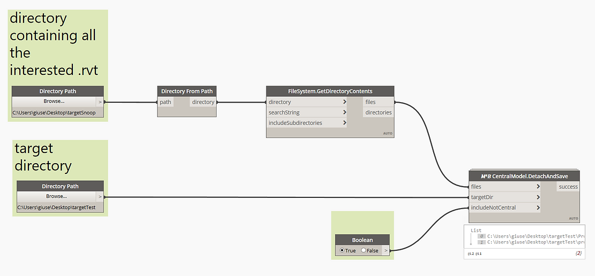

<!--
{"createdAt": "Oct 25, 2020",
"title": "Central Files Storage",
"views": 205,
"comments": [],
"votes": 3,
"published": true}
-->

# Central Files Storage

I remember that, when I was learning how to deal with **Workshared Revit Central files**, I was always in confusion with the way how to move the central file, how to archive it, or what to do with central files sent from someone else outside of my office.

Well, the guides were pretty clear: you have to create a detach file to be able to save it as a new central somewhere else. This is the only way to avoid your central file missing the reference to its original path.

To make easy what are the steps to follow, here a list:

- Open the file as detach
- Save as Name checking that "save as central", in the options, is checked
- Synchronize the model
- Change all the worksets to "Not Editable"
- Synchronize again

Everyone with a little bit of experience in Revit knows that this can take quite a few times since opening, saving, and synchronizing a model, are operations that require the model to be reloaded and cannot be performed in parallel.

Now, don't you think that repeat this all operations for a **set of Central files** is quite a repetitive and tedious task?

I do, and that is the reason why I developed a macro for this task

## How to use

These all operations are performed by a single node - 𝑀⁴𝐵 CentralModel.DetachAndSave - you can found in the "Utilities" category of the Macro4BIM package. The node requires to know the path of each Revit project you want to open as detach and save as name in the target directory.

Here a screen of a simple routine to perform the task:

> :::image-large
>
> 

curiosity: Also the files that are not workshared can be open as detach. The limitation is that, of course, they cannot be saved as central files!

This explains why a toggle to include or exclude the Revit Non-Central files from the Open>SaveAs workflow has been added as a third input.

Setting the toggle to True, the Non-Central file will be saved in the target directory skipping the "save as central" option.

The output from the not contains or the paths of the just saved files or the exceptions that may have been occurred (e.g. if in the target dir there is already a file named as the file "in arrive").

For any further information or observation, don't hesitate to take advantage of the comments chat below.

Cheers!
