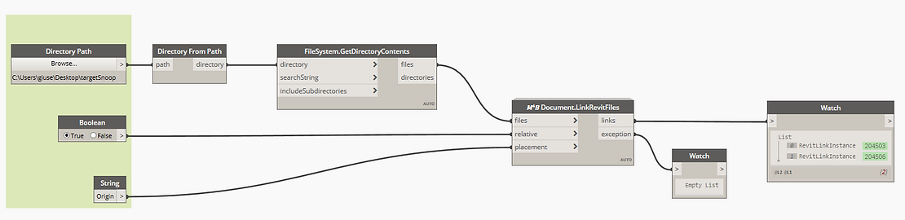

<!--
{"createdAt": "Oct 30, 2020",
"title": "Link multiple Revit Files at a time",
"views": 1324,
"comments": [],
"votes": 4,
"published": true}
-->

# Link multiple Revit Files at a time!

Hello friends, we all know that one of the BIM key points is the interoperability.

That is one of the reasons why we always have to deal with several Revit models to be linked together in a single working file.

The link of a Revit project is a task pretty delicate and probably is for this very reason that our lovely program allows us to import just one single Revit model at a time. But what if we need to **link a set of projects** with the same specs?

Here is where Macro4BIM comes, giving one more solution to speed up the work.

## How to

The operations are performed by the node "𝑀⁴𝐵 Document.LinkRevitFiles".

> :::image-large
>
> 

As you can see, as well in this routine have been decided to use OOTB nodes to collect all the interesting link paths. What is important to specify is that the M4B custom node, take into consideration only the .rvt files provided from the list. So, even if in your directory there are different files and some of them are not even Revit files, don't worry!
curiosity: the Revit files filtering is thanks to a single Python line that accepts only the paths containing the string ".rvt"

About the other two inputs, with them you can specify the settings to apply at all the files about to be linked:

- relative is expecting a boolean and can turn the link path to relative (bool = True) or absolute (bool = False).
- placement is expecting a string and give you the possibility to define the placement setting of the project to be linked. The allowed strings for that input are "Origin", "Site", "Centered" and "Shared".

Something else to add about the topic? Share you thoughts in the comments below!
Cheers!
