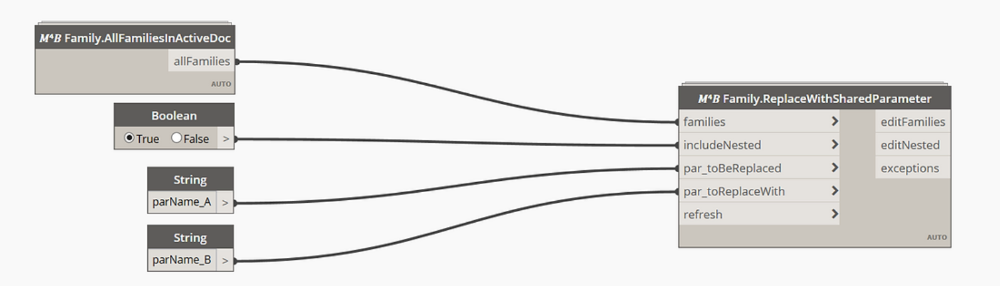

<!-- {
"createdAt": "Nov 13, 2020",
"title": "Advanced shared parameters management",
"views": 899,
"comments": [],
"votes": 3,
"tags": ["Dynamo", "Revit API", "Python", "Revit Family"],
"published": true
} -->

# Advanced shared parameters management

What a useful and incredible satisfaction is to extract all the information and quantities we need from our informative models? To do so, we need to work in an environment very well organized and the challenge is to let it be flexible as well.

Some times ago I was facing a problem with some **family parameters that have to be replaced with "shared parameters"** so as to be able to schedule them.

In a brilliant world, this can happen for maybe a couple of families and so you take 5-10 minutes of your time to fix it but, what if the change has to be applied on a larger scale?

And does anyone thought about the possibility of having **nested families** that contains the invalid parameter to be changed? that would increase the load of work, wouldn't it?

My solution for that task is a script that will actually dive deep down into the families and their nested with the purpose of replacing the parameter with a shared parameter and the **reload** the edited family in the document/family that contains it.

## How To

For that purpose I realized a dedicated Dynamo custom node:

> 𝑀⁴𝐵 Family.ReplaceWithSharedParameter

Since that node performs the whole task above described, its way to be used is very easy. Here a screen of a Dynamo graphic where the node is used:

> :::image-small
>
> 

This specific graph aims to replace all the families parameter named _parName_A_ with the shared parameter named _parName_B_ **already present in the shared parameter file** to which Revit is pointing.
In case the parameter to replace with (_parName_B_) hasn't been created and is not listed in the shared parameters file, The node will not execute and, from the exception output, a message informing that no _parName_B_ have been found, will be displayed.

Lets now describe the output:

- editFamilies: list containing all the names of the family in the project that have been edited.
- editNested: list containing all the nested families edit\*
- exception: if something went wrong during the script execution, the error message is collected here.

\*As you might imagine, was not so foregone to create this list. Mainly for representation and comprehensive reasons. The first try was a list containing lists, which eventually contains lists, etc etc... Depending on the family three, this approach could look like a mess. This is the reason why I decided to return a solution more human-readable, taking cue from the classic directory paths to whose everyone is costumed. So here an example of a nested family name you can read in this list:

> FamilyInDoc / NestedFam1 / NestedFam2 / NestedFam3

The edit family is the _NestedFam3_.
NestedFam1 is the family nested in FamilyDoc, NestedFam2 is the one nested in NestedFam1 and NestedFam3 is nested in NestedFam2.

At that point, you should have all the skills to approach the task and let the macro works!
**We finished with the overall presentation**.

<span style="color: darkgrey">
However, for this post, I decided to go a little bit further and talk about what is inside the custom node and, more in detail, what are the ideas guarded in the <span style="color: black">Python</span> script!
<br/>
Are you interested? Let's go Head
</span>

---

The study I want to show you in this section regards the definition of a python function that aims to replace a family parameter while the family is **in the document** but its document is **not open**.

We won't reproduce exactly the code contained in the Dynamo M4B Custom Node but part of the same logic will be applied. Here is the function to study:

```python
def replaceParam(doc, doc_fam, par_toBeReplaced, extDef):
	success = []
	warnings = []
	try:
		famPar = doc_fam.FamilyManager.Parameters
		currentParameters = dict([[p.Definition.Name, p] for p in famPar])

		# REPLACE
		toBeReplaced = currentParameters.get(par_toBeReplaced)
		if toBeReplaced != None:
			ParGroup = toBeReplaced.Definition.ParameterGroup

			trFam = Transaction(doc_fam, "TransactionInFamily")
			trFam.Start()
			doc_fam.FamilyManager.ReplaceParameter(toBeReplaced, extDef, ParGroup, toBeReplaced.IsInstance)
			trFam.Commit()

			success.append(str(doc_fam.Title).replace(".rfa", ""))
			doc_fam.LoadFamily(doc, FamilyOption())

	except Exception as ex:
		msg = fam.Name + ": family not edited\nERROR: " + str(ex)
		warnings.append( msg )

	return	[success, warnings]
```

The first thing you can see is that all the function is contained in a try/except statement, which will assure us to let always the function works, even when the provided inputs are not correct. In the worst-case scenario, it will return the exception that breaks the function, above named msg: a string telling us which family hasn't been edited and, in a new line of the string, the error displayed as a descriptive text.

On the main body of the function, you can see it start with this code

> famPar = doc_fam.FamilyManager.Parameters

That is actually giving us the possibility of access to all the parameters of the family selected document (doc_fam).

Once get all the parameters, I immediately decided to store them as a **Python dictionary** so that would be easier to get the required parameter. Because a dictionary is compound by keys (which are strings) and values, was automatic the idea of creating a dictionary defining **as keys the parameter name** and **as values the parameter** itself.

Here comes the research of the parameter to be replaced, in the code named "toBeReplaced".
Python dictionary has the method **.get(\***key**\*)** taking as input the key and returning the value, differently than the normal dictionary[key] for having values, the method will not return any errors in case the key provided isn't in the dictionary, in that case, the .get() will simply return a None object.
This explains why, right after had defined "toBeReplaced", an **if** statement to be sure that the value exists in the dictionary (and so the parameter exists in the family) have been placed.

> <span style="color: red">if</span> toBeReplaced != None:

Then everything is created in function of the correct use of this method of the Family Manager class

<pre>ReplaceParameter(
    <u>FamilyParameter</u> <i>currentParameter</i>,
    <u>ExternalDefinition</u> <i>familyDefinition</i>,
    <u>BuiltInParameterGroup</u> <i>parameterGroup</i>,
    <u>bool</u> <i>isInstance</i>
)</pre>

In the above showed code, showing the function as is in M4B custom node, the application looks like that:

> doc_fam.FamilyManager.**ReplaceParameter**(toBeReplaced, extDef, ParGroup, toBeReplaced.IsInstance)

- We already talked and showed how to get the FamilyParameter, named "toBeReplaced"
- The ExternalDefinition named "extDef", comes from the inputs of the function, in fact, it is representing the shared parameter we what to replace with.
- The input BuiltInParameterGroup is actually showing us that at that step we could also change the group where to store the new parameter but, since is not requested by the workflow performed by the M4B code, we decide to keep as the same as the previous parameter. To discover the parameter group it has been used the property **ParameterGroup** of the Definition class:
  > ParGroup = toBeReplaced.Definition.ParameterGroup
- Similarly, for the input that defines if the replaced parameter will be instance or type-based, the Parameter's property **.IsInstance** have been used so to have the same typology as the replaced one.

The last part, actually pretty interesting, regards the reload of the family in the document.

As you might know, the Document of a Family can be get by using the Document method .EditFamily().

> doc_fam = doc.**EditFamily**(family)

This method returns a Document, the family document, so to work on it. It is not properly like opening a document but is definitely how to Edit a Family from the project, you can also not save it after your edit but, if you want to keep the changes, you definitely need to **load back** in the project and **override** the existing version.

For that purpose there is a dedicated method of the Document class, as you can see in the function above showed:

<pre>LoadFamily(
    <u>Document</u> <i>targetDocument</i>,
    <u>IFamilyLoadOptions</u> <i>familyLoadOptions</i>
)</pre>

In our function, written like so

> doc_fam.LoadFamily(doc, FamilyOption())o

The legitimate question now could be

> what [IFamilyLoadOptions](https://apidocs.co/apps/revit/2020/d447ed92-74e1-2125-dd0a-38a5ae85ce53.htm) is?

and the answer is "An interface class which provide the callback for family load options", in Python, the way to call it, is to create a class and define inside it what are the values we are expecting for it.

On what purpose? Being able to deliberately decide if to override the existing version of the family to load in the project...


So, here is how to define that class in Python with the required specs:

```python
class FamilyOption(IFamilyLoadOptions):
def OnFamilyFound(self, familyInUse, overwriteParameterValues):
familyInUse = True
overwriteParameterValues = False
return True
def OnSharedFamilyFound(self, sharedFamily, familyInUse, source, overwriteParameterValues):
familyInUse = True
return True
```

And at this [link](https://apidocs.co/apps/revit/2020/d447ed92-74e1-2125-dd0a-38a5ae85ce53.htm), you can get some information more about the Revit API class.

Hope you found the post as useful as interesting.
As always, feedback and comments below are more then welcome.
Cheers!
