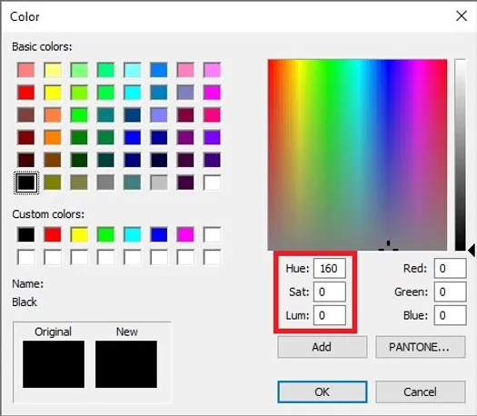
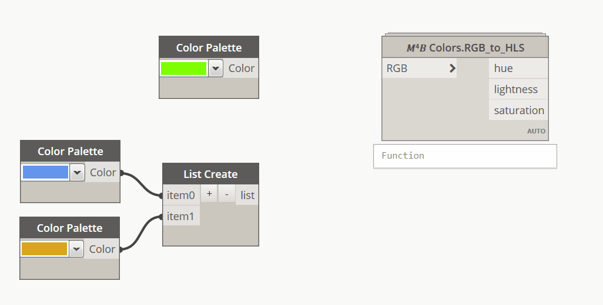
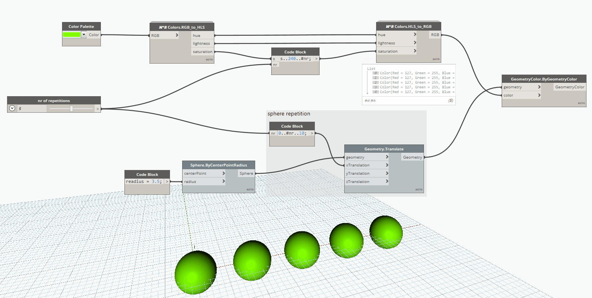

<!-- {
"createdAt": "Dec 5, 2020",
"title": "Why Limit Yourself to RGB?",
"views": 390,
"votes": 3,
"tags": ["Dynamo", "Revit API", "Python"],
"published": true
} -->

# Why Limit Yourself to RGB?

The need of having more freedom in the color definition within the Dynamo environment is in my opinion ruled by an easy observation: the way Revit let us choose between its color palette.

> :::image-small
>
> 

The one above, in case you didn't recognize, is a screenshot from the Revit palette and as you can see, on the left side of the Red, Green, and Blue values, there are Hue Saturation and Luminosity (highlighted by the red rectangle).

Each one of the 3 sets of values defines a **color model** that can of course create the same color but displayed using a different format.  
Folks say that the #HLS Color Model (Hue, Luminosity, and Saturation) is **the most human friendly** and the so the most readable. I agree and, especially for creating a range of colors, I often took advantage of this one instead of the #RGB (Red, Green Blue).

---

It can't be considered a macro for BIM but is definitely a useful tool I decided to include in the Macro4BIM dynamo package.

## How To

The way how it works is pretty simple: two separate nodes, one for **conversion from RGB to HLS** and a second one for **conversion from HLS to RGB**.

The peculiarity of this conversion is that, while for the RGB the node eats directly the dynamo colors, for the HLS it returns just the three separated values for each color so that can be freely managed with the intent to **convert it back**.

Here a short gif to better understand the concept:

> :::image-small
>
> 

Once we have the color defined in HLS, is important to jump back into the RGB model because **colors in Dynamo can only be created using RGB**.
That means that we need to know a little bit about how the HLS values can be expressed.

---

The **rules** the HLS color model has to follow are simple and in the script I made there are a few tips¹ that will avoid eventual issues:

> **hue**, from 0 to 239. You pick colors from the left to the right of the bar below.  
> (is familiar, isn't it? yes, is the same you saw before in the Revit palette!)
>
> **lightness**, values from 0 to 240, where 0 is dark, 240 is white. 
> (looking at the Revit palette, is the bar on the right)
>
> **saturation**, values for 0 to 240 hat refers to the intensity of the color, the less the saturation is, the more the color is grey. At saturation equal to 0, no matter what hue you're going to use, you can only have black, greys or white.  
> (looking at the Revit palette, the saturation value change in the vertical lines of the hue box)

---

Now that the system is clear, let's pass to the practice, here a simple .gif shows you some possible application to create a new color range starting from a single RGB color.

> :::image-large
>
> 

¹curiosity above I mentioned some tips useful to avoid possible issues. They are all about the specific range for each HLS value, in case the value is out of range:

- for the hue, I would say that the input will cycle through the 0-239 range. That means that for example if you give "250" as input, the script will read "11" or, if you give "-10", "239" will be written. Looking at the hue bar (that sometimes is represented as a circle) it makes sense and will not alter the progression.
- for both lightness and saturation, the range is the limit so all the numbers above 240 will be read as 240 and all the negative values will be taken as 0.

---

Hope you found this post useful,
And now, let's go giving new awesome colors to our BIM elements!

Feel free to subscribe to the website, allowing me to keep you updated!
Comments below are always welcomed,
Cheers!
