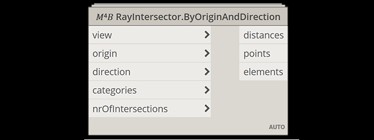
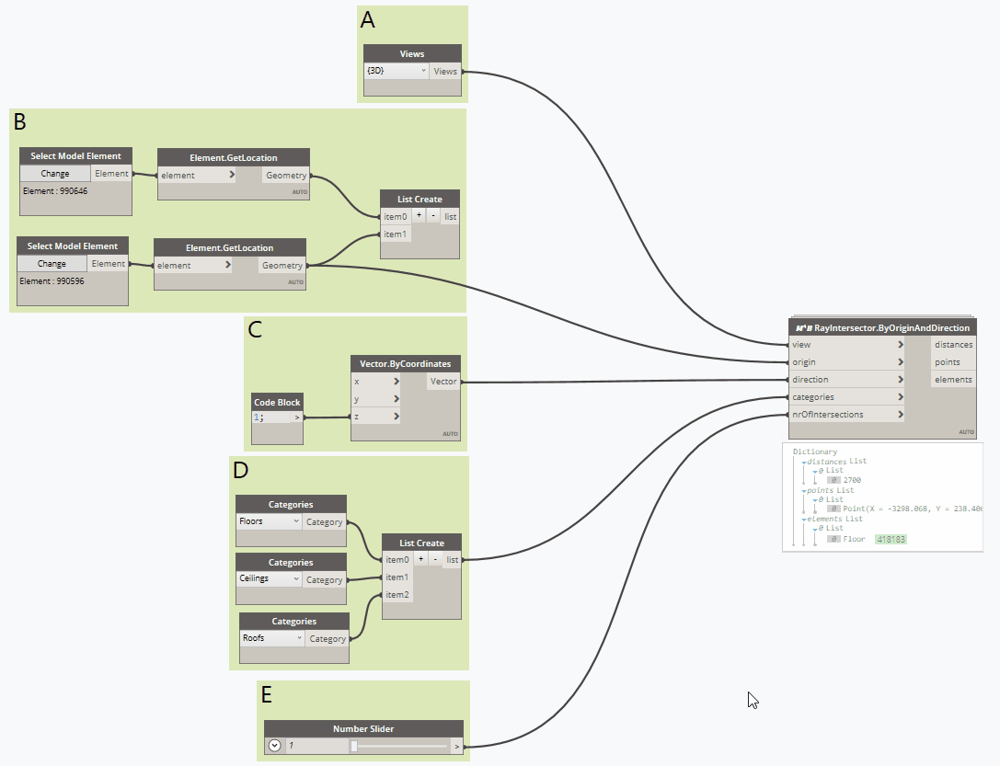
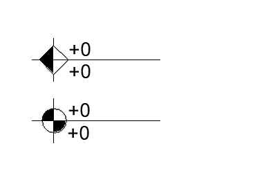
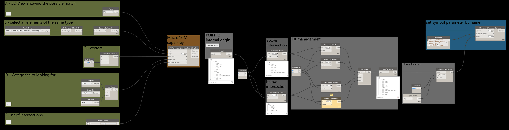
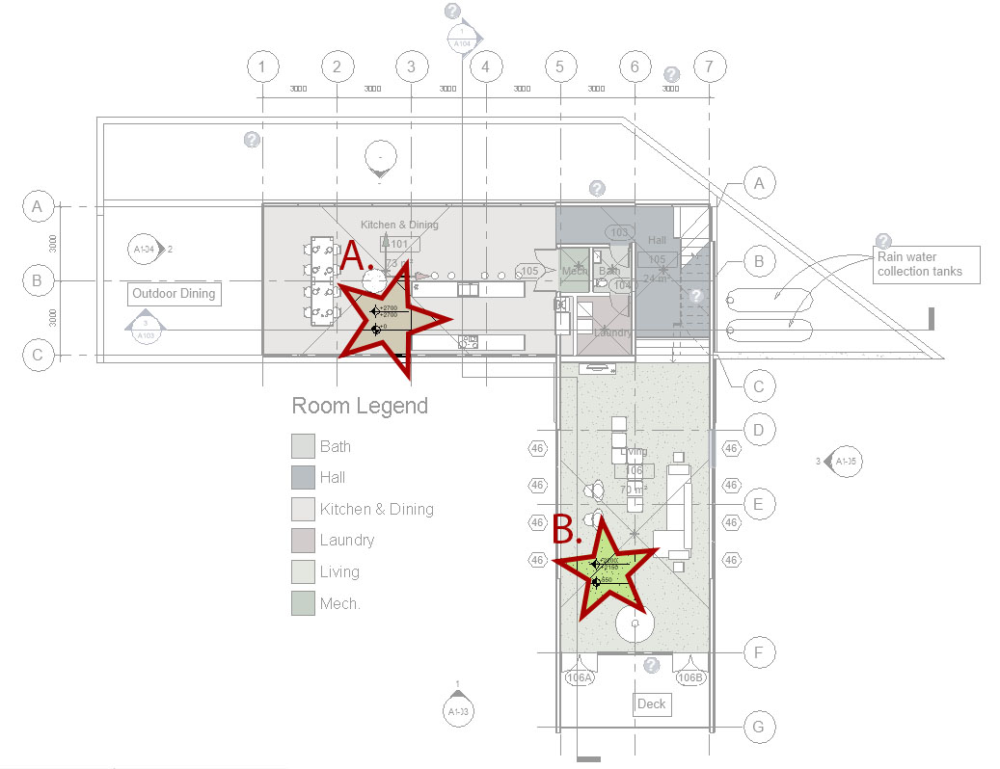
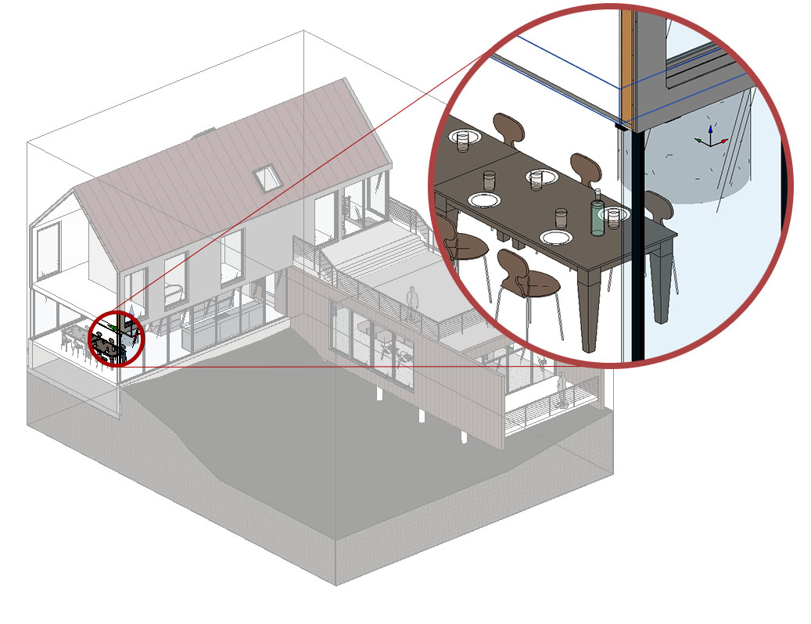

<!-- {
"createdAt": "Dec 13, 2020",
"title": "RayIntersector: the super-ray of Revit",
"tags": ["Dynamo", "Revit API"],
"votes": 2,
"views": 980,
"published": true
} -->

# RayIntersector: the super-ray of Revit

#RayBounce, we can define it as an object present in the ProtoGeometry library and so in the OOTB Dynamo nodes. This is a very powerful tool since gives you the possibility to investigate the model and its content starting from just a 3D View.  
The concept is as follows: in a 3D View, you define a point (so called ray's origin) and a direction. The computer will shot a ray from the origin, moving in the given direction, and will return to you the hitting element and the point where it was hit.  
At Macro4BIM we investigate how could we make this tool even more efficient and what additional **super-powers** it could have.

Today I will present you with the **RayIntersector**!

> :::image-small
>
> 

To use this new hero of the dynamo canvas, the nodes you are going to need to have are:

- 𝑀⁴𝐵 RayItersector.ByOriginAndDirection
- 𝑀⁴𝐵 RayItersector.ByOriginAndDirection_Link
- 𝑀⁴𝐵 RayItersector.ByOriginAndDirection_Material

And, respectively, their special skills are the possibility of retrieve also the intersected element(s) **beyond** the first hit element, the element(s) own by a **linked model**, or return directly the **material** of the first surface hit by the ray.

This all was possible because of the use of the [ReferenceIntersector](https://apidocs.co/apps/revit/2020/36f82b40-1065-2305-e260-18fc618e756f.htm) class from the #RevitAPI, which, with a basic characteristic of "crossing" instead of "bouncing" on the element, retrieve us a Reference, other RevitAPI class fundamental to extract all the information we are looking for.

Now that the new tool has been introduced, I hope you are starting to see the advantages we all can take out from them. But don't forget...

> :::image-small
>
> 

So here a quick and hopefully easy post to help you in mastering the RayIntersector and showing how it can be used for creating a useful #macro, or I should say #Macro4BIM.

## How To

First of all, a quick look at what the nodes' inputs are expecting from you:

> :::image-small
>
> 

In order, the <i style="color: red">view</i> is looking for a **3DView containing all the elements** potentially picked by the ray. You have to know that the ReferenceIntersector class is working on a specified 3DView and we can consider the visibility setting of the view as a first **filter** applied to the RayIntersector.  
<i style="color: red">Origin</i> and <i style="color: red">Direction</i> simply define the starting point and the direction of the "shouted" ray.  
The <i style="color: red">categories</i> input can be considered as the second (and in my opinion more efficient\*) filter you can apply to the RayIntersector.  
Last but to least is <i style="color:red">nrOfIntersections</i> which define the number of objects- and so intersections - the ray will pass through.

*My tip is to use a 3DView containing pretty all the elements and then make sure your rays are pointing to the desired elements just by defining the appropriate set o categories at this input.

As always, the best way to very understand methods such as that one is to see them in actions:

> :::image-large
>
> 

From the gif above is interesting to see how the outputs that collect all the results (distances, points, and elements) are structured in sub-lists, **one per each point**.  
This is clearly visible when, editing the group "B" - from a single point to a list containing two points - each output display 2 sub-lists, each one with the requested amount of intersections (defined in group "E").

Another important thing to know is that, by default, the script will set the **lacing** between the origin point and the direction of the ray, as **Longest**. This means that if, like in the example above, we provide more points than vectors, the last vector of the provided list will be used for all the remaining points. (e.g. you want to evaluate vertical rays for multiple points)  
Vice versa, if there are more vectors, the last point will be used for creating a ray for each of the remaining directions. (e.g. you want to evaluate a radial set of rays starting from the same origin)

The "𝑀⁴𝐵 RayItersector.ByOriginAndDirection_Link" node works the same way with the difference that will take into consideration also the **Revit Links** as long as they are visible in the view and are intersecting the ray with elements of the requested categories.

Some small differences happen in the "𝑀⁴𝐵 RayItersector.ByOriginAndDirection_Material" node. Here, to avoid the overload of the calculation and maximize the performance, the node will not recognize the link and will return **only the first reference** intersected by the ray.  
That also means that the outputs (distances, points, elements, and materials) are no more structured in sub-lists, while the lacing origin-direction stays set to Longest in the script.

---

Now that the introduction to the RayIntersector is done, let's talk about the useful #macro that could be used in all of our projects.

> :::image-small
>
> 

The #SpotElevation tags in Revit are very useful and they give us also the possibility of tagging the elevation at the top and bottom finish floor.  
However, might happen that this information is not enough for us, we might want info about the ceiling elevation and also the elevation of the element above it, typically the structural slab.  
Last but not least, we often model the architecture floor separate from the structural one, which is supposed to stay in a linked model. In this case, the elevation that informs us about the floor thickness is not always useful.

Let's not see how too fill all the elevation shown in the symbol above, in order from top to bottom:

- Construction Bottom
- Ceiling Bottom
- Floor Top
- Construction Top

As always, for better understand and study the tools, I always suggest testing them practically on a project. In this case, I decided to use one of the most famous projects of the last years: the RAC_basic_sample_project of Revit! 
The Dynamo graph I realized for showing you the tools in action is as follow:

> :::image-large
>
> 

You see that there is a "yellow node", that is because I am asking for looking at 2 intersections per vector but, in some cases, there is just one element to intersect in the model.

Another thing that is important to focus on is the lacing I set for the origin input of the M4B node. By defining it **@L1**, was possible to repeat the whole requests for all the origins (aka the placement point of the family symbol).

The last thing that let this script possible and very easy to apply is the fact that the Z of the points representing the intersections between the super-ray and the Revit elements, take as 0 the #InternalOrigin of the project. That means that this can be used as a reference to calculate also the elevation from the #SurveyPoint or the #ProjectBasePoint, which is just about to sum or subtract the appropriate value to each Z value.

I have to be honest, at first look, I thought I made a mistake because, if you see, the first intersection returns two times the same Z value (for the above intersections).  
Then I checked in the model and... braking news:

> :::image-large
>
> 

Wondering why in position A. both the "Construction Bottom" and the "Ceiling Bottom" are 2700 mm? Checking in the 3D, you'll see that the ceiling and the floor are really overlapping, "sharing" the same bottom elevation.

> :::image-large
>
> 

Incredible discovery, isn't it? ahah

> :::image-small
>
> 

---

So, also the application section has been written and, as always, I hope you found useful the post (useful and fun, fun is always important!).

Hello everyone,  
Cheers!
