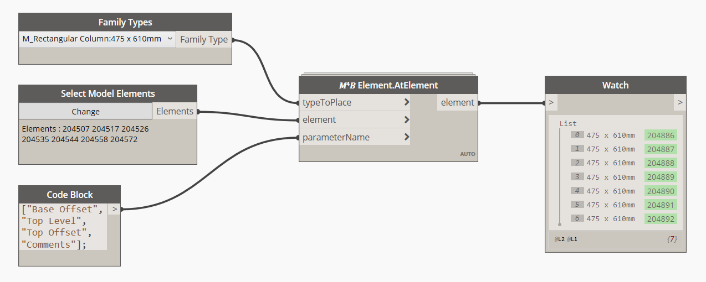

<!-- {
"createdAt": "Dec 31, 2020",
"title": "Architectural ⇄ Structural Columns",
"tags": ["Dynamo", "Python"],
"votes": 0,
"views": 257,
"published": true
} -->

# Architectural ⇄ Structural Columns

Sometimes ago I was struggling with a model containing quite a few structural columns that for specifics design needs have to be overlapped with architectural ones. <br />
We all know that placing structural columns at architectural ones position is quite easy thanks to a standard Revit tool and so I thought: "why can't we have the vice versa?".


There we go, in this little post, I will show you how **programmatically place architectural columns at structural columns**.

## How to

The tool we will use for this demonstration born for this very need but, meanwhile I was developing it, I realized that could have been much more flexible than a tool for "just placing" and so I added a couple of interesting features:

- automatic rotation of the placed element according to the reference family instance
- inheritance of specific parameters value

Here the Dynamo graph, easy and effective.



As you can see, the parameters' names defined in the Code Block are pointing at parameters of different typology such as <i style="color:red">Double</i>, <i style="color:red">ElementId</i>, <i style="color:red">String</i> (so-called "Length", "Level" and "Text" in Revit) and, whatever the parameter type is, the #M4B node will be able to transfer the value\*.

I believe you already know the result provided by the script above but, just for further clarifications, the family instances displayed in the watch node on the right, are architectural column placed **exactly in the same position** as the selected structural columns ("Select Mode Elements" node on the left) and having the same **rotation**, "Base Offset", "Top Level", "Top Offset" and "Comments" parameter values. <br />
Note that all the parameters above listed are **Instance Parameters**, is important to know since the way to edit a type parameter is different than the one contained into the #M4B node.

---

\*Here we go with a classic tag in my post: curiosity

> how to get always the correct parameter value type using a python code?

The answer is in that little function

```python
def getValue(par):
    if par.StorageType == StorageType.Double:
        return par.AsDouble()
    elif par.StorageType == StorageType.Integer:
        return par.AsInteger()
    elif par.StorageType == StorageType.ElementId:
        return par.AsElementId()
    elif par.StorageType == StorageType.String:
        return par.AsString()
```

Once collected the value, the parameters' method **.Set()** can be applied to the new element's parameter and the two instances will have the same value for the same parameter.

---

I think that's all, quick and hopefully interesting, let me know in case you have some feedback!

I know we are not allowed to make great parties but, considering what day is today... Let's try our best for a rocking 2021!


Cheers!
