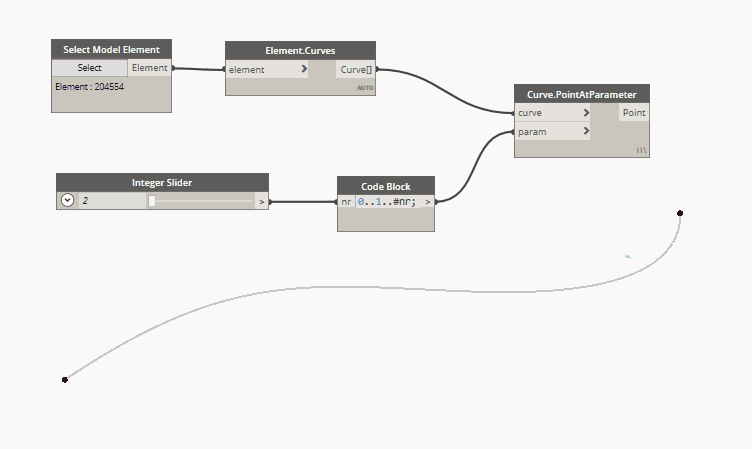
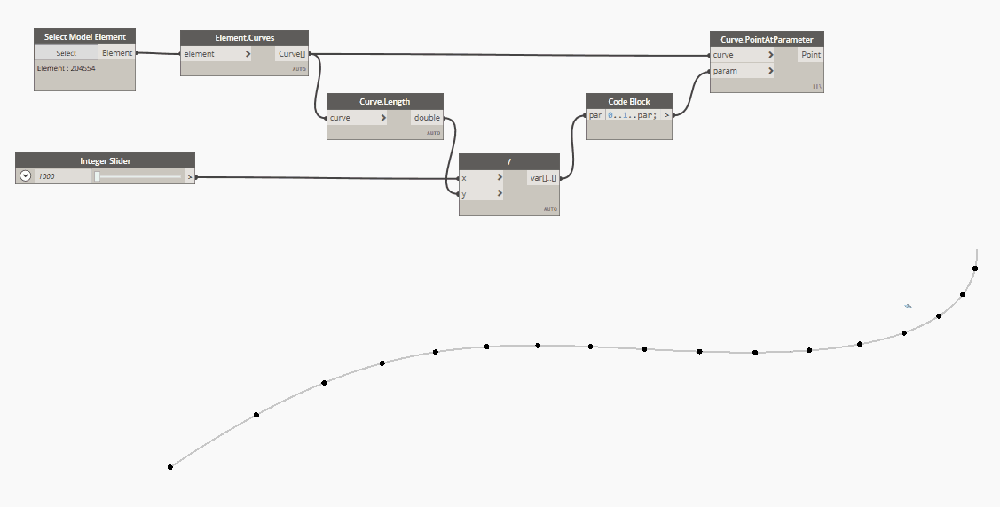
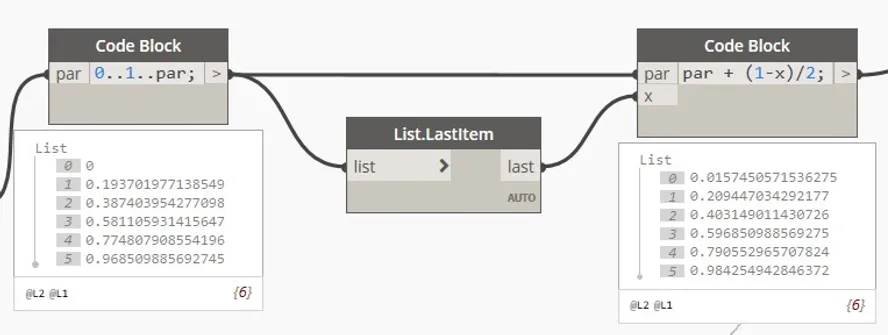
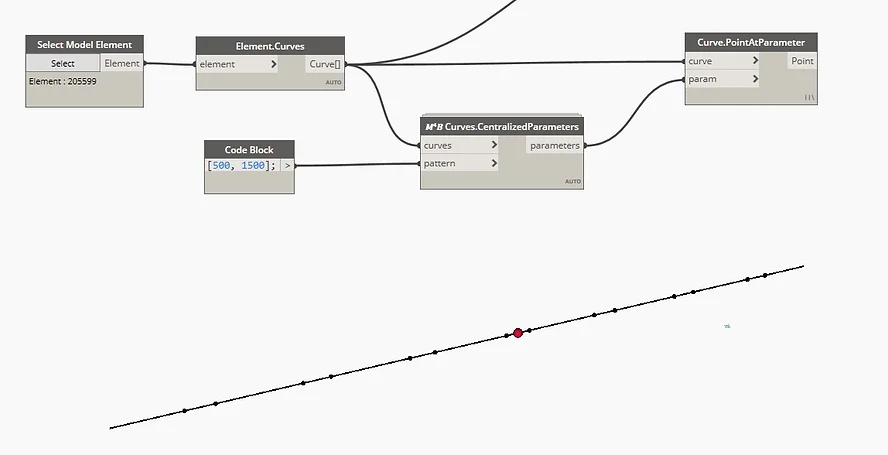
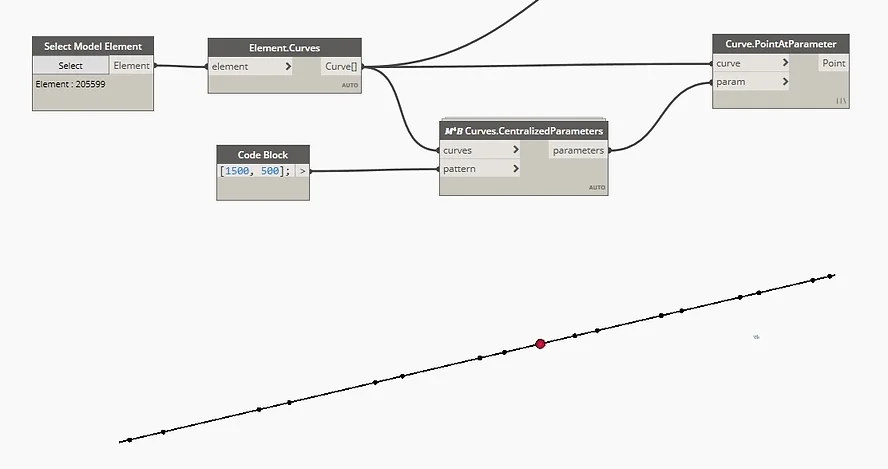
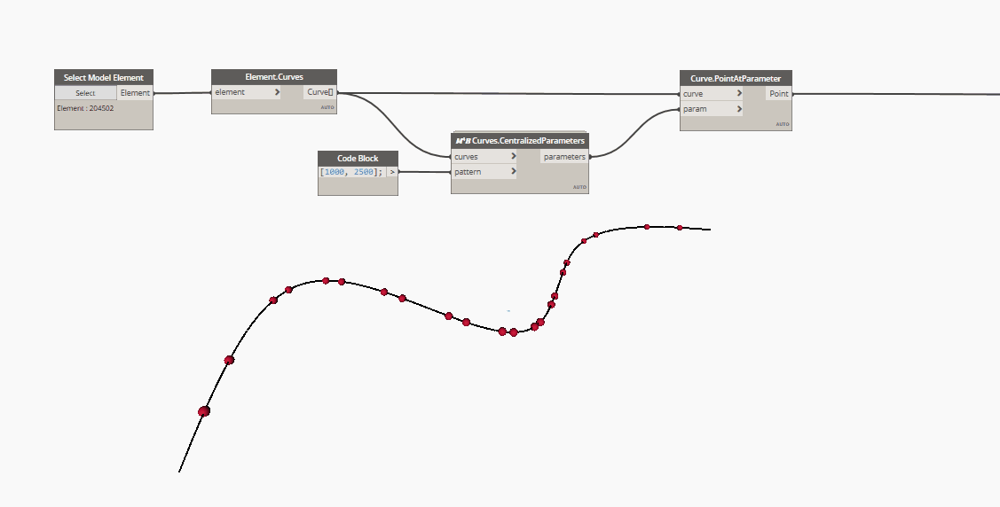
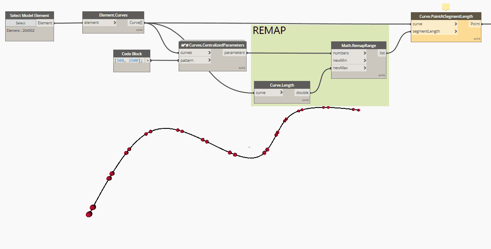

<!-- {
"createdAt": "Mar 23, 2021",
"title": "Spacing justification + 🐍 tip",
"tags": ["Dynamo", "Python"],
"votes": 2,
"views": 693,
"published": true
} -->

# Spacing justification + 🐍 tip

When I first approached the magic world of Dynamo, "**Curve.PointAtParameter**" has been one of the most fascinating nodes. It gave me the idea of the parametrized length, from 0 to 1, of all the curves and also a practical and easy example of iteration.

What usually happens in each Dynamo basic course is _"you can use the code block to define a range from 0 to 1 of how many numbers you want and, once plugged in the above-quoted node, this series will become points!"_

In this post, I want to explore some applications of this basic exercise and show you a Macro4BIM custom node that achieves a result that I honestly find nice.

**1. Equal distribution of a defined number of point**

In code block language:

`0..1..#nr`

Where nr value defines the numbers of points.

> :::image-large
>
> 

**2. Equal length distribution justified at curve start**

In code block language:

`0..1..par`

Where par defines the parametrized spacing between points. <br />
This is math, parametrized means from 0 to 1, where 0 is the start of the curve and 1 is the end (total length) of the same one. Here the formula for how to parametrize the spacing value:

`curve.Length() : 1 = spacing : par`

> :::image-large
>
> 

**3. Equal length distribution justified at curve end**

This justification follows the same logic as the above one but with a simple edit in the code block that creates the series. In this case, in fact, the code block has to contain:

`1..0..-par`

Yes, series can also move in a negative direction, keep attention on the "-" after the par input.

**4. Equal length distribution justified at center**

This justification follows the same logic as the above ones but with a logic edit after the code block. In case we decide to use the code block used for the "start justification", we'll need to add half of the difference between the last value and 1, to all the parameter values. <br />
Here is how this concept looks written in code blocks.

> :::image-large
>
> 

**✨ 5. Equal length distribution of multiple values justified at center ✨**

This justification, more complicated than all the ones above, is the reason why this post has been written. <br />
Often happen that a single dimension pattern is not enough for design purposes, which require multiple subdivisions, potentially, justified in a specific way. <br />
What #Macro4BIM created is exactly a node for the ones of you that are looking for a special subdivision:

> :::image-large
>
> 

> :::image-large
>
> 

The above images are showing two subdivisions with the same pattern, a space of 1500 followed by another by 500. <br />
They look different simply because the lists defining the pattern start with a different value, the first starts with 500 while the second starts with 1500. To make more understandable what the node does, I placed this red sphere which represents the center of the curve.

---

Python tip 🐍
And now let's dive a bit deeper and let's talk about code, today I have a nice tip that I have used for the above-quoted node and I'm sure you'll love it!

> :::image-small
>
> 

**the issue to solve**: Let a python code works on every kind of list (list, list of list, ...)

**used function**: <span style="color:#dec328">lambda</span> function, also known as anonymous functions

**code**:

```python
func_nest = lambda fx, lst: [fx(i) if not isinstance(i, list) else func_nest(fx, i) for i in lst]
```

The function named "**func_nest**" is applying a defined function "**fx**" to all the items of a list "**lst**" as long as these are not listed, in this case, the lambda function <span style="color:red">re-run itself</span>. <br />
With this single line of code, you are able to apply a specific function to all the elements in a list of whatever dimensions!

Codes such as this one are extremely useful also for application easy such as the one described above and let your Dynamo workflow flow way better. A great advantage, in fact, is that you can let your function run <b style="color:#dec328">without altering the list structure given as input</b> !!!

---

Hope you found useful the post in both its sections (useful and fun, like always!).<br />
All of your thoughts are more than appreciate.

Hello everyone, <br />
Cheers!

---

### \*EDIT

Thanks to [elie TRAD](https://www.linkedin.com/in/elietrad/) that spotlights an important exception to know when you work with parameters on curves.

<p style="color: #de5021">In the case of <b>NurbsCurves</b>, a list of equally distributed and parametrized parameters does not return a list of equally distributed points on the curve, geometrically speaking.</p>

Here is a gif showing a series of points placed at curve parameters. As you can see, the points at the curve's extremity are way more spaced than the ones at the center.

> :::image-large
>
> 

To solve this issue, as suggested in elie's video, you can use the Point.AtSegmentLength node, after had remapped the parameters' values from "0 to 1" to "0 to Curve.Length".

> :::image-large
>
> 
