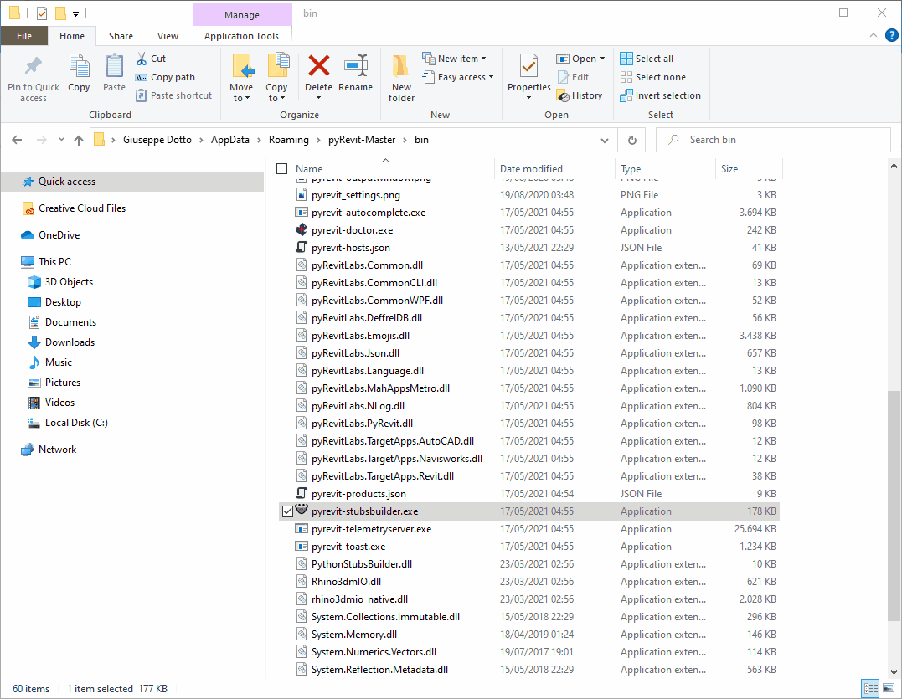

<!-- {
"createdAt": "Jul 7, 2021",
"title": "Create Python Stubs 🤖",
"tags": ["Revit API", "Python"],
"votes": 0,
"views": 1987,
"published": true
} -->

# Create Python Stubs 🤖

In a post of some time ago, I talked about the implementation of intelliSense and autocompletion of your Revit code using Visual Studio Code. [VSCode intelliSense for Revit](https://www.macro4bim.com/post/vscode-intellisense-for-revit). <br />
As you can see from there, a side note is alerting you that, depending on the Revit version you are working on, the autocompletion could not be that accurate because the stubs might be not updates.

Well, this side note doesn't make me feel any fear anymore, because of a _majestic_ program "hidden" in the pyRevit-Master repository, the pyrevit-stubsbuilder.exe!<br />
With this, we can **create python stubs for any Revit version**!

> :::image-small
>
> 

During this post, I'll show you how I used it and what's the result. But first, Many thanks to Ehsan Iran-Nejad and Steve Baer at McNeel, creators of the opensource program. <br />
[GitHub - mcneel/pythonstubs: Python stubs for .NET assemblies](https://github.com/mcneel/pythonstubs)

## Where to

Once installed pyRevit, you can find the application at the following path:

> %appdata%\pyRevit-Master\bin

the name of the file is **pyrevit-stubsbuilder.exe** and, if you try running it, apparently nothing is happening.

## How to

I'll guide you through the way I studied and ran this application. considering it is a .exe file and a prompt was visible for some milliseconds on my screen when I was running the app, I decided to run the program manually from the **command prompt**.

Of course, everything is easier if you run the command prompt directly from the directory containing the program.

_Tip_: You can do this by typing "cmd" on the windows search bar.

> :::image-large
>
> 

Once opened the program, you will also be albe to ask for help with the following command line:

```bat
pyrevit-stubsbuilder.exe -h
```

and here is the answer:

```bat
Usage:
pystubsbuilder (-h | --help)
pystubsbuilder (-V | --version)
pystubsbuilder [--dest=<dest_path>] [--search=<search_path>...] <target_dll>...

Options:
    -h --help               Show this help
    -V --version            Show version
    --dest=<dest_path>      Path to save the subs to
    --search=<search_path>  Path to search for referenced assemblies
```

There is not very much to add, right? Maybe just a couple of clarifications around the _<target_dll>_, that is the golden **RevitAPI.dll** and the _--search_ which is to use in case the dll is referencing other dlls, the tool will look into the search folders to find them.

Just for completion, let me run live a test creating some Revit 2020 stubs on a new folder just created on my desktop. Here is how it looks:

```bat
pyrevit-stubsbuilder.exe --dest="C:\Users\giuse\OneDrive\Desktop\New folder" "C:\Program Files\Autodesk\Revit 2020\RevitAPI.dll"

target path is C:\Users\giuse\OneDrive\Desktop\New folder
building stubs for C:\Program Files\Autodesk\Revit 2020\RevitAPI.dll
stubs saved to C:\Users\giuse\OneDrive\Desktop\New folder\Autodesk
```

---

> :::image-small
>
> **AND NOW WE HAVE THE STUBS**
>
> Fast and silent, like a ninja!
>
> 

Just for completion, this, for me, was the path to add to the extra-path for the autocompletion: <br />
<i>"C:\\Users\\giuse\\AppData\\Roaming\\py_stubs\\Autodesk\\Revit"</i>

**_That said..._**

The method above quoted is the one I used once discovered the application but not the only one.

For those of you that prefer to have a life a bit easier, taking advantage of some masters works... here it goes:

[pyRevit/extensions/pyRevitDevTools.extension/pyRevitDev.tab/Developer Tools.panel/Generate API Stubs.pushbutton at master · eirannejad/pyRevit · GitHub](https://github.com/eirannejad/pyRevit/tree/master/extensions/pyRevitDevTools.extension/pyRevitDev.tab/Developer%20Tools.panel/Generate%20API%20Stubs.pushbutton)

This is a pyRevit pushbutton that does exactly what is said above, for the Revit version in use.

---

I've nothing else to say than SPLENDID... or, well, that old but gold SMOKIN'!!!

> :::image-small
>
> 

Hope you enjoyed the post,<br />
Cheers!
