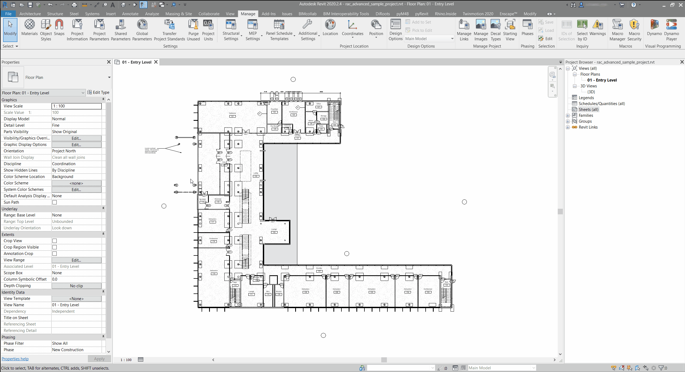

<!-- {
"createdAt": "Jul 18, 2021",
"title": "Link Element Section Box",
"tags": ["Revit API", "Python", "pyM4B"],
"votes": 0,
"views": 946,
"published": true
} -->

# Link Element Section Box

Folks, this is a special post to me, the very first i wrote with a friend and follower of the #Macro4BIM project! He is Antonio Miano, you can reach out to him [here](https://www.linkedin.com/in/antonio-miano/).

---

How many times did you have to create a **section box** around elements from **linked Revit files**? This situation is very common, especially when dealing with federated models.<br />
In these situations, Dynamo is not the best solution, too articulated and too many buttons to press I would say. Here it comes our pyRevit extension #pyM4B !

In this post we will explore the “SectionBox RevitLinks” bundle that goes beyond a significant limitation of the Revit UI: **create a section box around picked elements that come from linked Revit projects**.

## How to

The workflow is very simple: once you launch the command by clicking on the button, you will be asked to pick elements from links (you can also pick elements from different links!) and then press the Finish button. The command will create a 3D view named “3D_SectionBoxRL_username” where username will be replaced by the name of the Revit user (in this way, each user will work on its own view; very handy for workshared models).



_Curiosity_

Sometimes it may happen that the Revit link to which the selected element belongs has been moved from its original position or even, that there are multiple instances of the same link across the document (and therefore the element itself is repeated several times).

Believe me or not, but Revit alway remembers the geometrical origin of the link, independentely from the place where it has been moved after placement!

That assumed, <br />
**How can we be sure that the section box will be correctly created around the proper linked element(s)?**

You have to know that once you pick an element through the UI, you get a Reference Object; And, also in case you pick on a linked element, you can read some important properties:

1. The ID of the RevitLinkInstance the element belongs to.
2. The ID of the element itself.

from the prop 1 in possible to retrieve the **transformation of the link instance**, while from the prop 2 is possible to get the **geometric representation** of the element,

At this point, all we had to do was to apply\* the transformation of the link instance to the geometric representation of the element and then ask for the bounding box that encloses that geometry element.

\*When said "apply", was meant the creation of a <span style="color: grey">transformed copy of the geometry in this element</span> through the use of the method [.GetTransformed()](https://apidocs.co/apps/revit/2022/549182ac-29d1-1482-efff-6ab0a8525227.htm)

Here an excerpt of the Python code behind the bundle that shows this step (“er” is the picked element’s reference).

```python
link_inst = doc.GetElement(er.ElementId)
link_inst_transform = link_inst.GetTotalTransform()
link_doc = link_inst.GetLinkDocument()
link_elem = link_doc.GetElement(er.LinkedElementId)
link_elem_geom = link_elem.get_Geometry(DB.Options()).GetTransformed(link_inst_transform)
bb = link_elem_geom.GetBoundingBox()
```

---

Hope you found it useful and enjoyable, <br />
Cheers!
