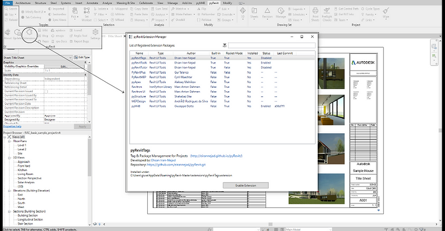

<!-- {
"createdAt": "Sep 23, 2021",
"title": "Install pyM4B for pyRevit",
"tags": ["pyM4B"],
"votes": 0,
"views": 1450,
"published": true
} -->

# Install pyM4B for pyRevit

Hi All, autumn 2021, the season of the falling leaves, will also be the season of #pyM4B starts!

> :::image-small
>
> 

As you might have read from the main page of the website, #pyM4B is the Macro4BIM extension for #pyRevit.  
For those of you not familiar with this **majestic** plug-in, here is the reference: [pyRevit (notion.so)](https://www.notion.so/pyrevitlabs/pyRevit-bd907d6292ed4ce997c46e84b6ef67a0)

---

To install a new extension that is not already available from the pyRevit Extensions window ↴

> :::image-large
>
> 

it is suggested to edit the **extension.json** file located in

> %appdata%/pyRevit-Master/extensions

For the Python-speakers like me, in this .json file there is contained a sort of a dictionary with one single key named "extensions", having as value a list of dictionaries which are building-up all the information about the extensions ready to be installed, eventually, from a Git repository.

## Where to

Macro4BIM created a public repository on #GitHub on which pyRevit can refer to, and download all the information needed. Here is the link: 
[GiuseppeDotto/pyM4B.extension: Macro4BIM extension for pyRevit (github.com)](https://github.com/GiuseppeDotto/pyM4B.extension)

In case you want to add suggestions, as always, you're more than welcome to do so via the website, the mail, or also via GitHub. 😁

## How to

As promised, an installer for the Macro4BIM extension has been developed. Run it, is as easy as double-clicking an icon. You can download the program from here:

> ⚠️ DOWNLOAD NO MORE AVAILABLE ⚠️
>
> <small style="color: grey">(FYI: we have a better solution)</small>

No matters if you have Revit opened or not while you are running the install, the only crucial thing, of course, is that **you have installed pyRevit** on your machine before running the program.

Once the installation is complete, it might take like 3 seconds, you'll see a message on your DOS informing you if everything went as expected and, if so, the extension.json file we were talking about before, will be nicely edited. 
You can now go back to the Extensions window of pyRevit, click on the row regarding #pyM4B, and hit the install button!

Is important for you to know that the pyM4B extension won't be kept updated by itself, in case you know that some new functions have been implemented in it, you have to **update it** "manually"... the quotes are because, honestly speaking, all that you have to do is to click the button on the left of the Extension button we saw before!

pyRevit will automatically reconnect to the Git repository and update all the contents to the new and improved version!!!

> :::image-small
>
> 

---

Nothing else to say, it should all be pretty easy, clear, and useful... hopefully! This is definitely the beginning of a long journey that might bring a lot of satisfaction and great ideas to develop, it depends on all of us...

THERE WE GOOOO!

Cheers
