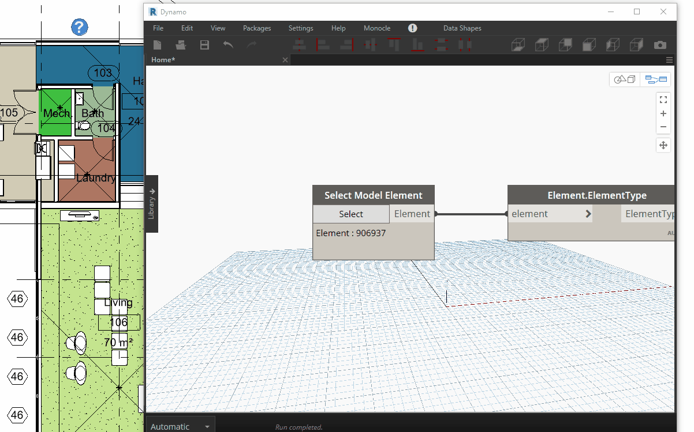

<!-- {
"createdAt": "Jan 24, 2022",
"title": "Control/Maintain Subcategories",
"tags": ["Dynamo"],
"votes": 0,
"views": 352,
"published": true
} -->

# Control/Maintain Subcategories

Hi guys and welcome back,

Have you ever dealt with subcategories? If so, you know how difficult and tedious it is to take them all under control between projects and families. So we decided to develop a solution to make the project-family **subcategory comparison easy** and productive!

But first, let me try to be didactic and go one step back...

## What it is

When it is not coming from the system (e.g. Project Base Point), a Subcategory is the **style** of a component that lives inside a family of a certain Category. The more classic examples concern the doors, where an example of subcategory could be the lines indicating the swing opening in the plan or elevation.

## Why care about

_They are responsible for the graphic of your model_. **Control** them means control very much in detail the level of your output.<br />
Unfortunately, they might also be added to the model because of a loaded family\* not consistent with the project template you are using.

<span style="color:red">\*maybe a family downloaded from external parts?? very common, eh?</span>

What you do want to **avoid** is:

- having too many subcategories in the project. _You might not know what to set_
- having subcategories in the families but not in the project. _You won't be able to edit certain things_

---

Cool, now let's go practical, #Macro4BIM just developed a tool to **help you to control** such an important matter which gives you the possibility of collecting all the existing subcategories in the project and **comparing** them with the ones in the given families.

## How to

To make the task accessible to everyone, we made a very easy Dynamo node which takes as _input_ just the family you want to examine and return in the _output_ four <span style="color:orange">sets</span> containing **1)** all of the subcategories in the family **2)** the ones matching with the project subcategory **3)** the ones not matching, AKA the bad subcategories in the family but not in the project **4)** the project subcategories missing from the family.

In order to avoid confusion, only the name of the subcategories is displayed, anticipated by the name of the main category following this syntax:

> MainCategory - Subcategory

The script literally opens the family in edit mode and reads the subcategories from the **family document** itself.<br />
Impressive eh? You might be scared by the times it may take, don't worry, the family opens in the background of Revit, you won't see it, and the operation is speedy. Give a look at the GIF below, which records the node in real-time.

> :::image-large
>
> 

---

**Curiosity**: I'm sure you saw I named the outputs "sets", yes was very intentional because I want to let you focus on this Python collection and how crucial it was for this M4B node.<br />
In the code, 2 sets each family have been defined, one for the family subc. and the other for the project subc.. Differently from the lists, the sets support certain operations for comparison and here is the portion of the code you might find pretty explanatory:

```python
family_subcat = set( get_subcategories(fam) )
doc_subcat = set( get_proj_subcat(fam) )
matching_subcat = family_subcat.intersection(doc_subcat)
not_matching_subcat = family_subcat - doc_subcat
not_matching_subcat = doc_subcat - family_subcat
```

Since the subcategories follow the same naming convention of above, all the sets contain strings, potentially, identical which permit the comparison!

---

The applications of this node are multiple and I'll be curious to hear back from you on the matter!

> :::image-small
>
> WE FOUND THE WAY TO RULE THE SUBcategories!
>
> 

Hope you find it useful and <i>pythonically</i> interesting!! <br />
Cheers!
