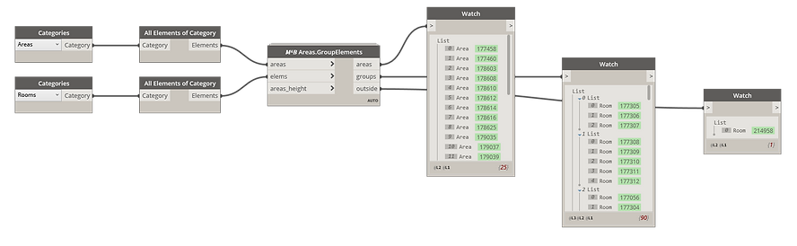
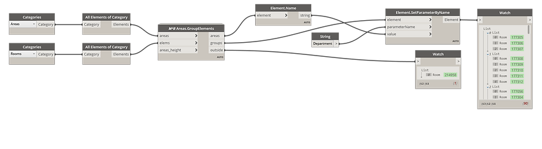
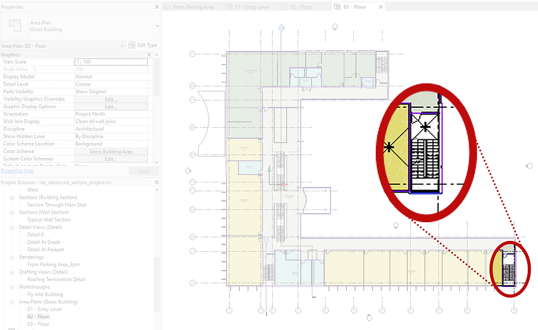

<!-- {
"createdAt": "Jan 28, 2022",
"title": "What is in the Areas?",
"tags": ["Dynamo", "Revit API", "Python"],
"votes": 0,
"views": 188,
"published": true
} -->

# What is in the Areas?

> :::image-small
>
> 

What is in the Areas?
Hello everyone,

Rooms are definitely an excellent class, but sometimes we need to deal with their parents, the **Areas**. It can be for different purposes such as defining the apartments, offices, departments... in general, spaces that are represented by a set of rooms.

If you approach the Areas from a computational point of view, you can realize how limited they are compared to Rooms, and today I want to talk about one big limit: **They don't define a 3D volume**. This can represent a problem when you want to determine <b style="color:blue">what is inside of which area</b>.

For this purpose, Macro4BIM realized a custom Dynamo node,

    Revit.𝑀⁴𝐵 Areas.GroupElements

and with this post, I want to dive a little bit deeper into what it does and how. 🔍

## How to

As you can see from the node itself, you provide the interested areas and elements, and the node will sort and group all the elements so as to return a two-dimensional list (list with sublists) that **matches** the output list of the areas.

It is important to **always use the list of the areas in output** because of the way the script is calculating the presence of an element in the area. In fact, what the script does is literally create a solid for each one of the areas - depending on how the area boundaries are drawn, this process <b style="color:red">could fail</b>!

Since I don't want to stop the whole node because of a few potentially problematic Areas, I just built a way to replace those Areas with a null value so that you can easily filter them out.

**FYI**, each 'problematic' area corresponds to an empty list in the group output. This is to grant the correct match in any conditions. ✌

## Example of application

I decided to go for the good old <i>rac_advanced_sample_project</i>.rvt that all of us know. The classic operation I performed is **grouping rooms by areas**, and here you can see the extremely easy dynamo graph that allows you to do so.

> :::image-large
>
> 

From this list of areas in output, you can then **extract the parameters** you are interested in and **apply their values to the elements** in the relative groups. Here is the example:

> :::image-large
>
> 

---

Now that the task is done and explained, let's take a breath... did you notice the same thing I noticed? **In the sample model there is a room outside of any Area**! With this, it is the second time we spot something!! The first time was in the post about the [RayIntersector](https://www.macro4bim.com/post/rayintersector-the-super-ray-of-revit), where we discovered an overlap between ceiling and floor.

> :::image-large
>
> 

I don't know if it was intentional, probably yes, and everything is correct, but I still feel amazed that with our tests, we spot unexpected behavior... Shock!

> :::image-small
>
> 

---

I hope you all enjoyed the reading and also found it helpful! 
Cheers,
