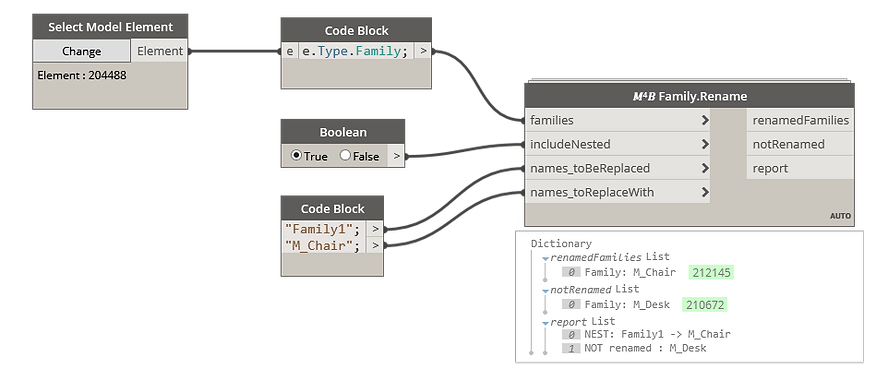

<!-- {
"createdAt": "Jan 30, 2022",
"title": "Rename Families and their nested",
"tags": ["Dynamo"],
"votes": 0,
"views": 554,
"published": true
} -->

# Rename Families and their nested

> :::image-small
>
> 

Hi all,

Here I am back for a quick tip I decided to develop inspired by a Dynamo Forum post.

As you can guess from the title, it concerns the naming of the family, a very common and important task for all the #BIMCoordinator, which can reasonably become tedious if you have to rename both the **families in the project and the nested ones**!!

## How to

Easy-peasy, we made a dynamo node in the M4B package that allows you to do the trick very efficiently in no-time.

> :::image-small
>
> 

However, you really need to keep **ATTENTION** to the two lists defining the "names to replace" and "names to replace with". 
They must be two different lists sharing the **same order** because, for instance, the name in 3rd position of the first list will be replaced only with the name in 3rd position of the second list.

... I know this might sound not very easy, but it's a workaround I ideate to give you the possibility of renaming multiple family names <b>simultaneously</b>.

Talking about the **report** output, this has been built to show you literally all the families the script reaches out. Per family, if it founds its name in the first list (names_toBeReplaced) will type `"previous_name -> new_name"`, otherwise, will type `"NOT renamed : family_name"`. In case the renamed (or not) family is a nested one, the string of above will be anticipated by a `"NEST: (...)"`. 
This way, you can easily understand **on which level** the function is operating.

> :::image-small
>
> How do you feel about it, speedy enough?
>
> 

---

**Curiosity**: the trick was made possible because of the Family class property "**Family.Name**", which gives us the possibility of renaming a family without changing the file itself. This property was particularly convenient for the nested families, where was enough to open a transaction in the main family document and rename all the nested, without the need of reloading the main family back in the project!

---

As always, I hope you enjoyed and fount it useful, 
Any question? comment below or drop me a text,

Cheers!
