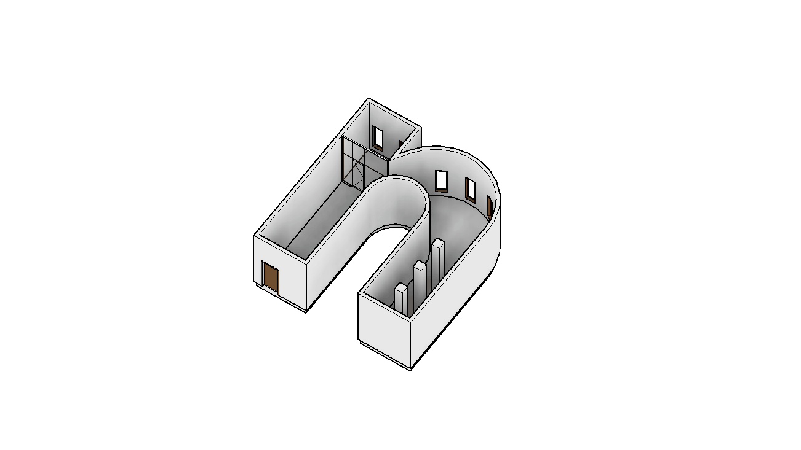
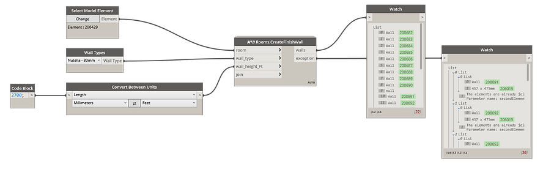

<!-- {
"createdAt": "Feb 5, 2022",
"title": "Create finish walls per Room",
"tags": ["Dynamo", "Revit API", "Python"],
"votes": 0,
"views": 487,
"published": true
} -->

# Create finish walls per Room

Hi guys,

Today, **5th of Feb**, is the **WORLD NUTELLA DAY** and I thought of something to celebrate it!<br />
Instead of the classic slice of bread, why don't we spread #Nutella as it is a delicious **wall finish** for a room?

Well, depending on the LOD to achieve, you might need to model this finish as a separate wall to calculate **quantities**, manage **representation**, and, why not, construction **phases**...

It is a relatively easy task for a dynamo use since it is possible to extract all the room boundaries that can be used as location lines for the wall to create in #Revit. Though, there are a couple of <span style="color:red">inconveniences</span> that make this workflow harder:

- Not all the boundary lines are supposed to host a finish wall.
- The wall has to be built with an offset from the boundary equal to half of the wall type width. This is because we can't create a wall based on "Finish face" with Dynamo.
- The finish walls need to wrap the room and be cut in correspondence of wall openings.

We _solved them all_ with this nice and clean solution out from the M4B #Dynamo package.

> :::image-large
>
> 

## How to

Believe in it or not, it is just a single dynamo node 😁<br />
Here how the script looks like:

> :::image-large
>
> 

As you can see, we went straight forward asking as input, of course

- the room
- the wall type to use as finish
- the height of the finish in FEET\* EDIT: scroll down for more info
- and the possibility of joining the new wall with the existing element.

How the script works is pretty easy, it first takes the boundary of the room and, from each line, gathers the **geometric curve** and the **element responsible** for the presence of the boundary.<br />
This way, I've been able to elaborate on each of the segments and **avoid creating the finish wall** in case the segment sits in front of a room boundary line or a curtain-wall. On the other hand, if it sits in front of an existing wall, you can **automatically join** to transfer all the openings of the wall to the new wall.

You can also see from the image above that the potential <b style="color:red">exceptions</b> that occur when you join the new wall have been collected out from the node. In this case, the exceptions are due to the Architectural columns that, by default, join automatically to the wall and return an error if you try to re-join. Yes, The script creates **walls in front of all the elements**, not just walls!

---

## Want to know more?

A couple of **Curiosities** now comes with this workflow...

### 1. how can we be sure that the offset will always happen inward to the room?

The answer to this is in the module used to collect the lines that have been used to create a CurveLoop, which always comes in the correct orientation (Clockwise or counterclockwise) so as to offset the lines inward to the room. This is the snip of python code that does the trick:

```python
boundSeg = room.GetBoundarySegments(SpatialElementBoundaryOptions())
# GET NEW WALLS' LINES
lines = [[c.GetCurve() for c in crvs] for crvs in boundSeg]
loops = [CurveLoop.Create(x) for x in lines]
loops = [CurveLoop.CreateViaOffset(crvL, -wall_type.Width/2, XYZ(0,0,1)) for crvL in loops]
loops = [i for sub in loops for i in sub]
```

### 2. Why specify the height in Feet?

Well, the main reason is that starting from the Revit version 2022, in the #RevitAPI have been applied some changes about how to specify the Unit system, now they taste much more #Forge. In order to let the script be easily used by anyone independently from the Revit version, I just suggest you make a conversion before so to provide the feet, which are the Internal Units in Revit!

---

**EDIT**: the node is no more asking you to convert in Feet, this is because we've been seduced to talk about a way to avoid this extra step, and we are always keen on it!!<br />

You can read more about this change here: [Use ForgeTypeId for unit conversion](https://www.macro4bim.com/post/use-forgetypeid-for-unit-conversion)

---

With that said, I think it is all for **Nutella world day**... I know, unfortunately, I've just spread #digital Nutella on a #virtual wall... Hopefully, it has not been tasteful but helpful!!

> :::image-small
>
> side hope: maybe with the metaverse soon we'll find a way to taste a Nutella wall!
>
> 

I hope you enjoyed it,<br />
Fell free to reach out or comment for any questions,

Cheers!
