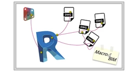
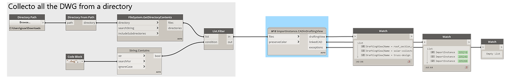

<!-- {
"createdAt": "Feb 7, 2022",
"title": "CAD in Revit Drafting Views",
"tags": ["Dynamo", "Revit API", "Python"],
"votes": 0,
"views": 704,
"published": false
} -->

# CAD in Revit Drafting Views

> :::image-small
>
> 

Hello people,

The reasons to which you want to have a set of CAD in your Revit project could be several. For instance, you want to **control the whole Drawing List** from Revit and so print some .dwg(s) from there as well.

The first thought of everyone could be: "ok, they both are Autodesk products, the link and print will be easy and automatic", but, well, we all know that the word **automatic** <span style="color:red">doesn't exist</span> without a perfect setup of all the involved files. But calm down, we have a workflow to make it easy!

---

In this post, we'll show a method to optimize the CADs link in Revit using a single Dynamo node that covers multiple tasks at once.

## How to

    Revit.𝑀⁴𝐵 ImportInstance.CADinDraftingView

Above is the name, and below is an example of it in action!!

> :::image-large
>
> 

As you can see, I used the OOTB Dynamo nodes to gather all the DWGs from a specific directory, and I plugged them\* all in the only input used of the node: **_files_**. (we'll talk later about the other input)<br />
It took maybe a _couple of seconds_ before to see all the outputs that contain the new **_Drafting Views_**, the new **Linked CAD\*\***, and the possible **_exceptions_** that could have happened during the journey... following these steps nothing bad should happen but, who knows, maybe you gather differently the file paths and it contains a mistake? Having placed an "exception possibility" to the node means <span style="color:orange">letting the script say something to you</span>!

\*Actually, what you plug are the path of each of the DWGs<br />
\*\* You might be interested in the name in Dynamo that says "ImportInstance", don't worry, they are all links! ImportInstance is just the name of the class in the Revit API.

---

> :::image-small
>
> 

Nice, cool, bla, bla, bla... but if you want to know more, let's stop with the chats and discuss the script! Here we're opening our classic section **Curiosity**!<br />
In this single node, the main operations are:

### Import multiple DWGs

All of us who like to automate things as much as possible can't probably live with the idea that you have to import each CAD separately, isn't it??

Here we just iterate through all of your paths, importing with the same basics options you can see here:

```python
options = DWGImportOptions()
options.AutoCorrectAlmostVHLines = True
options.OrientToView = True
options.ThisViewOnly = True
options.VisibleLayersOnly = True
if preserve_color:
	options.ColorMode = ImportColorMode.Preserved
else:
	options.ColorMode = ImportColorMode.BlackAndWhite
```

As you can see from the Dynamo graph above, we chose the default option (True) to import the DWGs **preserving the colors**, and soon, we're going to talk in another post about why we choose this setting, STAY TUNED!<br />
It is anyhow important, for those who didn't get from the script, that if you set the second input of the node to False, each imported DWG will be placed with the Revit option "Black and White".

### Create multiple Drafting View

The problem of importing multiple DWGs is surely to know where to place them! As we were picturing, our plan is to link each of them in a dedicated Drafting View, ideally named according to the CAD. We decided, for simplicity, to go for naming the Drafting View exactly as the CAD file. Of course, you're free to change it by the moment that the new views appear in the outputs.

---

So, also for this time, WE DID IT!<br />
Let me know how you found it helpful or maybe interesting enough for suggesting in your mind a new idea on how to integrate DWG with RVT in the same project.

Cheers!
