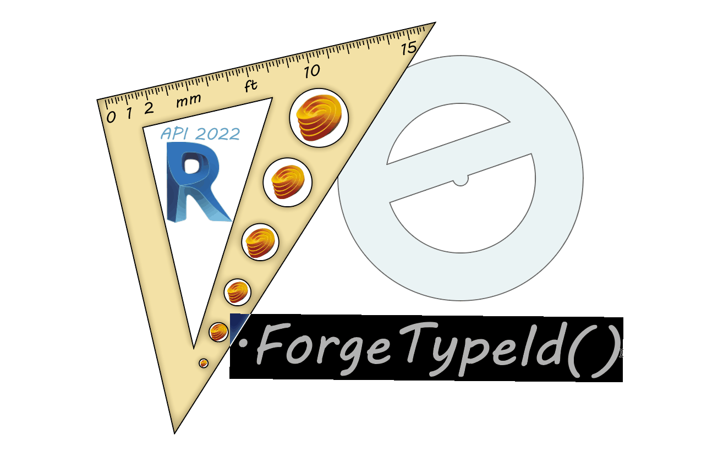

<!-- {
"createdAt": "Feb 9, 2022",
"title": "User ForgeTypeId for unit conversion",
"tags": ["Revit API", "Python"],
"votes": 2,
"views": 1051,
"published": true
} -->

# User ForgeTypeId for unit conversion



Hello everyone,

You know right which is the **best of the motivations** for me to write a new post aren't you?? <br />
Sure, is your feedback!! This post comes very close to a previous one where we introduced a method on how to [Create finish walls per Room](https://www.macro4bim.com/post/create-finish-walls-per-room), exactly because one of you asked:

_"Is there any way not to convert the units before putting the values in the node? "_

I think the question was very legit, at the end of the day, the majority of the people that look at a Dynamo solution, they do because want to **save time** and **avoid tedious** work...

---

For the sake of the old post, I've been happy to go that way so you all know that Revit works internally in feet. But now, I roll up my sleeves, change the script in the node, and explain to you

## how to convert units with python in Revit 2022

It's been a while that this topic is very discussed around the internet, that's because Autodesk announced some years ago a change in the #RevitAPI that would have introduced a new class

    ForgeTypeId

Among different use, one of them would have been the replacement of the DisplayUnitType, an enumeration to which we were always referencing to define the units.<br />
For a good time (till Revit V2021), Autodesk gave the possibility to work with both of them and in general, was more convenient to stick with the old method to grant compatibility with older versions of Revit.<br />
But now we can **no more**, the DisplayUnitType Enumeration disappeared from the #RevitAPI and we need to move on!

So, inspired by the sentence

    from Revit V22 onward, you need to use ForgeTypeId

we decided to write these couple of python functions that, prior to the recognition of the program version you're running, decide if to go for the old-fashioned or the new way of converting units. Here is the code:

```python
# from Revit V22 onward, you need to use ForgeTypeId

def unit_to_internal(doc, value):
	if int(doc.Application.VersionNumber) < 2022:
		um = doc.GetUnits().GetFormatOptions(UnitType.UT_Length).DisplayUnits
		return	UnitUtils.ConvertToInternalUnits(value, um)
	else:
		um = doc.GetUnits().GetFormatOptions(SpecTypeId.Length).GetUnitTypeId()
		return	UnitUtils.ConvertToInternalUnits(value, um)

def unit_from_internal(doc, value):
	if int(doc.Application.VersionNumber) < 2022:
		um = doc.GetUnits().GetFormatOptions(UnitType.UT_Length).DisplayUnits
		return	UnitUtils.ConvertFromInternalUnits(value, um)
	else:
		um = doc.GetUnits().GetFormatOptions(SpecTypeId.Length).GetUnitTypeId()
		return	UnitUtils.ConvertFromInternalUnits(value, um)

"""
in case you are working in mm
unit_to_internal(doc, 1) == 3.280839
unit_from_internal(doc, 1) == 304.8
"""
```

---

As you can see, I also add to the end of the code-snip a little description of how it will act.

This one was a very technical post and if you arrived reading until this line, well, congrats **bro**, I know you like to **code** as well!

> :::image-small
>
> That means knowing the BRO CODE!!
>
> 

After this quote, I finish the post with a giant smile,<br />
Cheers!!
