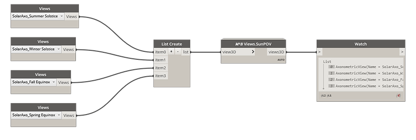
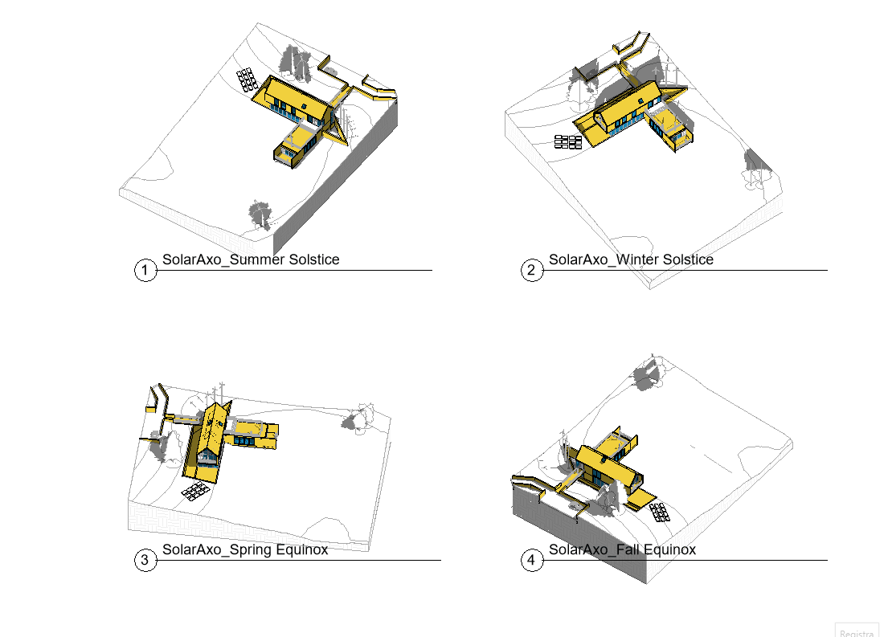

<!-- {
"createdAt": "Feb 14, 2022",
"title": "Daylight Analysis - Sun's point of view",
"tags": ["Dynamo", "Revit API", "Python"],
"votes": 2,
"views": 179,
"published": true
} -->

# Daylight Analysis - Sun's point of view

Hi all,

It's been some years, but I still remember when, during my second year of Architecture school, [Carlo Bughi](https://www.linkedin.com/in/carlobughi/), a good professor I had the chance to meet, thought me about **Solar Axonometries**\*. Since then, I always liked this way of performing daylight analysis but somehow was not as well known as I thought, and the majority of people prefer to have classic axonometries with shadows clearly cast.

Well, with this post I take the chance to thank again my professor and show you all an interesting and efficient method of performing daylight analysis, **_automatizing_** the creation of such views!

**Solar axonometries**: Axonometries perspective from the sun's point of view

---

## How to

easy, extremely easy, maybe too much... we condensed it all in a single Dynamo node that is asking you just to provide the view(s) whose cameras need to be oriented so to match the sun's point of view.

> :::image-large
>
> 
>
> 

**Amazing**, isn't it?! In all the views above, the shadows are clearly cast and, as soon as the view turns to be a Solar Axonometries, **they don't disappear**, they are simply beyond the object represented from the exactly Sun's point of view!

---

## Deep down in the code

Independently if you like or not the solar axonometries, you might find interesting how to reorient a Revit 3D view... so here is the step to step through the python code:

The steps are relatively easy and have been all coded with #Python

Considering that the sun position definitely depends on the true north, the **first step** is to get the true north angle. For this purpose I created a function that might be used later or simply copy-pasted into another code:

```python
def get_trueNorthAngle(doc):
	projectInfoElement = FilteredElementCollector(doc).OfCategory(BuiltInCategory.OST_ProjectBasePoint).FirstElement()
	bipAtn = BuiltInParameter.BASEPOINT_ANGLETON_PARAM

	par = projectInfoElement.Parameter[bipAtn]
	return par.AsDouble()
```

Once we have the north orientation, it starts the **interesting part of the code** which is looking for collecting the Azimuth and Altitude angles for each view and creating two **_transformations_** that will go to rotate the simple Y-axis vector.

Yes, indeed an interesting part of the code is the creation of transformations that can be applied altogether to the same object (the Y-axis), returning the expected vector in one single shot readable at line 17.

```python
trueNorthAngle = get_trueNorthAngle(doc)

out = []
for vw in views:
  sunSettings = vw.SunAndShadowSettings

  # ANGLES IN RADIANS
  altitude = sunSettings.GetFrameAltitude(sunSettings.ActiveFrame)
  azimuth = sunSettings.GetFrameAzimuth(sunSettings.ActiveFrame)
  altit_perp = Transform.CreateRotation(XYZ.BasisX, altitude + math.pi/2)

  # CREATE ROTATIONS
  altit = Transform.CreateRotation(XYZ.BasisX, altitude)
  azim = Transform.CreateRotation(XYZ.BasisZ, - azimuth + trueNorthAngle)

  # GET SUN DIRECTIONS
  sun_direction = azim.OfVector(altit.OfVector(XYZ.BasisY)).Multiply(-1)

  # ORIENT VIEW
  eye_position = XYZ()
  up_direction = azim.OfVector(altit_perp.OfVector(XYZ.BasisY))

  view_orientation = ViewOrientation3D(eye_position, up_direction, sun_direction)
  vw.SetOrientation(view_orientation)

  out.append(vw)

uidoc.UpdateAllOpenViews()

OUT = out
```

You might wonder why the _.UpdateAllOpenViews()_ at line 28. Well, this is because, as you can see, everything happened **outside of any Transaction**! Yes, that was possible because no edits have been performed to the database, though something happened and this something is concerning the **User Interface**\*.

**_Curiosity_**: without updating it, you would have not seen any changes, until you were moving something on the windows so to let it update/refresh.

---

With that said, shared and showed... <span style="color:orange">people that like the classic axonometries view</span> with the shadow, **what do you think now?** Am I really the only one in <b style="color:blue">love</b> with these views?

Yes, you read it well, in love... this is the reason why I'm sharing this content for St. Valentine's day, and this is the mood I want to cheers you, love and sunshine!

> :::image-small
>
> 

Cheers!
