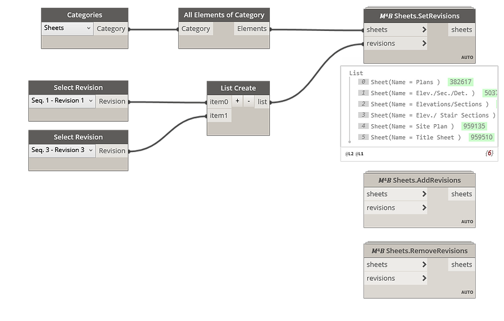

<!-- {
"createdAt": "Feb 18, 2022",
"title": "Manage Sheets Reviews",
"tags": ["Dynamo", "Revit API", "Python"],
"votes": 0,
"views": 238,
"published": true
} -->

# Manage Sheets Reviews

Hi all,

What a treasure the drawing list in a Revit project! I'm sure you already knew and agree that we should take care of it the most as possible! <br />
How many of you use a schedule on the title block showing the revision list of the sheet?

Useful, isn't it? Thought could also be the stage for very <span style="color:orange">manual and repetitive work</span> because editing the visibility of the reviews in the sheets can't be done but **sheet by sheet**!!<br />
Indeed, in case you don't remember, once you created all the revisions from the "View" panel in Revit, in order to let the review be visible in your title block you need to change the sheet parameter "Revisions on Sheet", ticking manually the revisions you want to show.

Don't panic, we came up with <b style="color:blue">a couple of solutions</b> to this task, and now we'll show both how to implement and how they work!

---

## How to edit Revisions on Sheet for multiple sheets

1. The first and easiest approach to this operation is by using #Dynamo, with the help of our Macro4BIM package. There you'll find 3 practical nodes:

- Revit.𝑀⁴𝐵 Sheets.SetRevisions
  - Defines what will be the revision visible for the input sheets. This will replace the current set of visible revisions on the sheet.
- Revit.𝑀⁴𝐵 Sheets.AddRevisions
  - Add a given revision to the current set of visible revisions on the sheet
- Revit.𝑀⁴𝐵 Sheets.RemoveRevisions
  - Add a given revision to the current set of visible revisions on the sheet

> :::image-large
>
> 

2. The second method is even more direct by the movement that doesn't require you to build any dynamo graph, as long as you are making use of our extension for #pyRevit. it is a single pushbutton with some nice UI forms which let you first pick the revisions, then the sheets, and at the end the operation (set, add or remove). <br />
   Below you can see a GIF recording and _addition_ and a set operation performed on **all the Sheets of the Revit model**.

> :::image-large
>
> 

---

We went very speedy on it, there was not very much to talk about since the practical operations were pretty **straightforward**. But now, for the interested one of you, I'd like to reserve a space to talk about the python code, how it works.

This all has been made possible because of two methods of the class **ViewSheet** class:

- [ViewSheet.GetAllRevisionIds()](https://apidocs.co/apps/revit/2022.1/e6f4e79f-c076-8085-5288-6e0b5a431177.htm)
- [ViewSheet.SetAdditionalRevisionIds(ICollection[ElementId])](https://apidocs.co/apps/revit/2022.1/376a4009-17f7-af8e-8c32-d95243ad8e9e.htm)

The first returns the full list of visible revisions in the sheet, and the second can set the same list. When I say "list" of revision, I actually refer to the ElementId class of each revision, collected in an iterable list which is not a native Python list, but a **List\[Type]**, a different kind of collector that can emulate a C# **ICollection**.

## Create ICollection equivalent in Python

To create such a type of collection both in a Dynamo script and a pyRevit pushbutton you can follow these methods:

```python
# List[Type] IN DYNAMO PYTHON-NODE

from System.Collections.Generic import *
revisions = [r.Id for r in revisions] #classic python list
List[ElementId](revisions) #List[Type] collection


# List[Type] IN PYREVIT PUSHBUTTON

from rpw.utils.dotnet import List
revisions = [r.Id for r in revisions] #classic python list
List[DB.ElementId](revisions) #List[Type] collection
```

---

And that was it, nice **tricks** to speed up the revisions management on sheets and a behind-the-scenes Pythonic solution. Very classic from us, right?

As always, I hope you enjoyed and feel free to reach me out via forms or comment down here!

Cheers!
