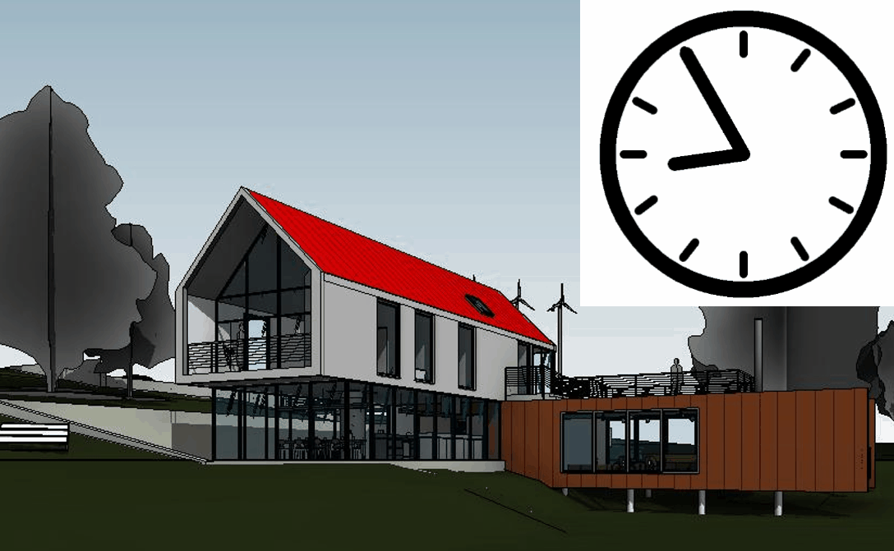
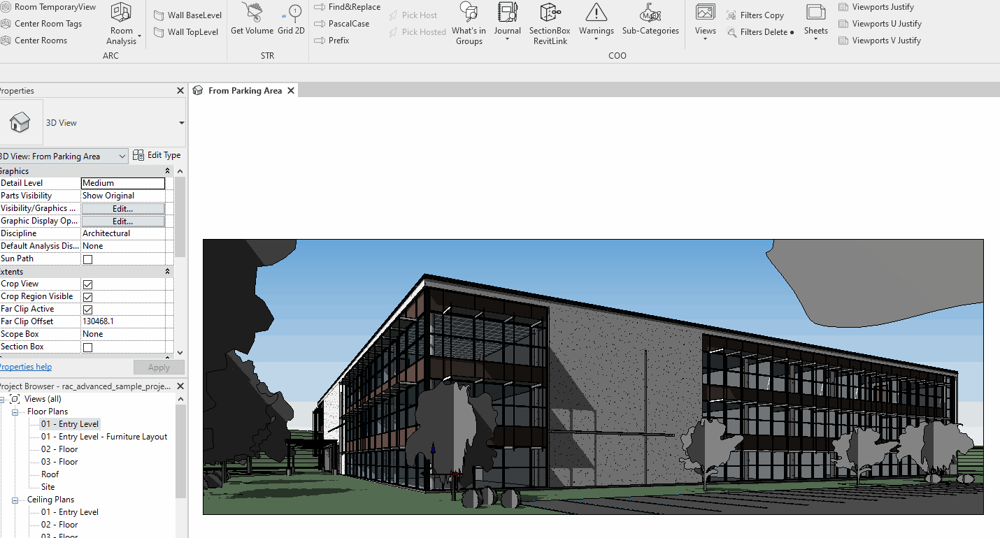
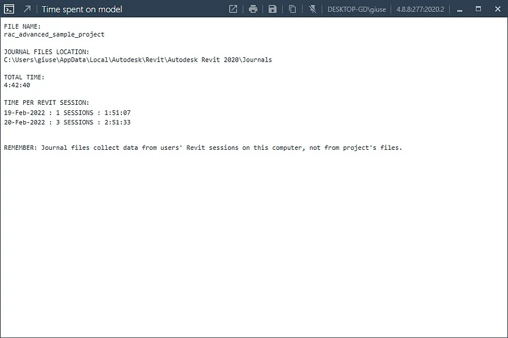
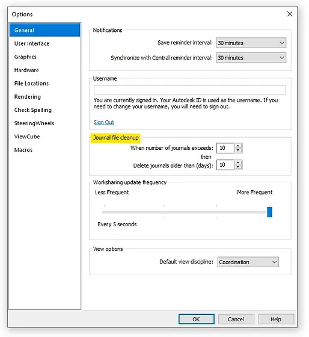
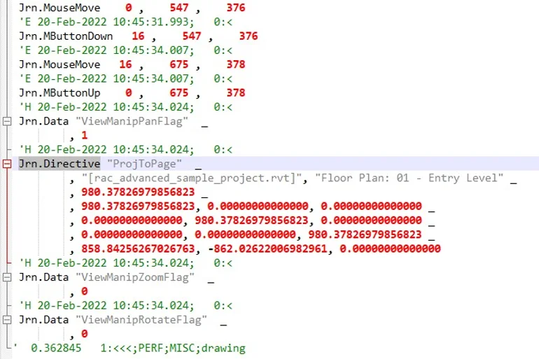

<!-- {
"createdAt": "Feb 21, 2022",
"title": "How long did I work on a project?",
"tags": ["Dynamo", "Revit API", "Python"],
"votes": 0,
"views": 1231,
"published": true
} -->

# How long did I work on a project?

> :::image-small
>
> 

Hello everyone,

I was talking with a friend when he said, a little for a joke a little for desperation, _"If I only knew the time I spent in front of this Revit model...!!"_. Suddenly the **M4B in me** woke up, ready to tell him the exact time!

To get the time spent on the model, the idea is to look at the **_Journal Files_**, this way is also possible to record the time spent **even if no savings nor synchronization happened**!

## What is a Journal File

Journal Files are TXT files used mainly to troubleshoot technical problems with Revit® products, they are located by default in

    %LOCALAPPDATA%\Autodesk\Revit\<Product name and release>\Journals

and they are monitoring literally everything that is happening during your Revit session, even when you move your mouse!!

> :::image-small
>
> 

---

## The Macro4BIM tool

For this purpose, Macro4BIM created a #pyRevit pushbutton which is just asking you to define what the project name you want to investigate is. 
As visible from the GIF below, the project you're currently working on will be set as default text of the form... that's for saving us these 5 seconds needed for typing the project name!!

> :::image-large
>
> 

Once all this info is extracted, we don't give only the total time, but we <b style="color:orange">articulate</b> the data showing also the day-by-day **number of sessions and time spent**! 
The tool comes with the whole pyM4B extension, for any questions feel free to reach out to us!

If you're curious about the backstage, how it works and how it was possible, keep on reading (😋) otherwise, here is a summary of what it does:

    The script is calculating **any time delta** between the user movements on the views of a **SAME project**.

and here is an example of the output window:

> :::image-large
>
> 

Of course, this all _highly depends on the journal files_, so you can go back in time depending on how many Journal Files you have on your pc. Watch out at your **frequency of Journal File cleanup** which by default is set to 10 days.

> :::image-large
>
> 

---

## How to collect time from Journal Files

As we were saying, in these TXTs is mapped literally everything, the challenge is now to **understand when certain operation is referring to a specific project** rather than the global Revit session. To do so, we need to open a journal file and read its structure. 
You can open any of yours and you'll see that they look something like this:

> :::image-small
>
> 

As visible, most of the operations show the DateTime, but not all of them tell on which project they are performing!! Luckily for us, the is this **_Jrn.Directive_** that also **specifies the project name** in its very first raw after the function name. 
This journal file operation is referring to **every movement that happens on a view**, like _Pan and Zoom_, and we agreed that this is the kind of operation that can give us a very nice estimation of the time spent working on a project.

The script, step-by-step, consists in

- reading all the journal files on your PC
- grouping all the Jrn.Directive operations
- recognize the operations referring to the given project name
- calculate the delta time between the operations
- exclude the time delta when the user is working on another project.

---

These days I'm in the Netherlands and it's blowing a strong wind like I never saw in life, it is a condition of true alert and everyone is encouraged to stay at home... well, a perfect time to develop this tool exercising my finger with a Python code!

> :::image-small
>
> 

I'm sure about the opinion of my friend I was talking about before, but I really hope you liked the tool and enjoyed the read as well!!

Cheers,
