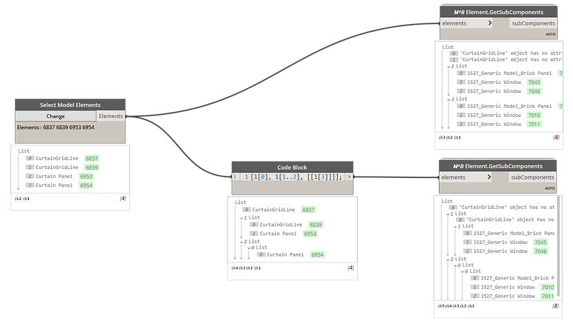
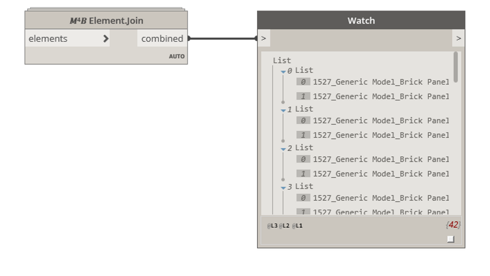

<!-- {
"createdAt": "Feb 22, 2022",
"title": "Join Nested Families",
"tags": ["Dynamo", "Revit API", "Python"],
"votes": 0,
"views": 380,
"published": true
} -->

# Join Nested Families

Hi all,

here is a quick post born because of a friendly talk landed on some Revit topics with my friend [Behzad](https://www.linkedin.com/in/behzad-gharehjanloo-858361161/), BIM Coordinator at [Handel Architects](https://www.handelarchitects.com/), NY.

He just showed me a very **interesting way for model facades** which consists of **_nesting inside of a Curtain Panel_** other families of Windows, Generic Models, Door, ... (of course depends on the facade).

All perfect, but for the fact that <span style="color:red">remains to join each nested component to each other</span> so to grant the **correct representation** output. Well, the Dynamo world is plenty of solutions for joining different Revit elements, though I decided to explore a new one that performs very well and, together with a little node for getting the nested families, would have surely helped my friend!!

---

## How to get nested families in Dynamo

First-step first, this was an easy one, was just a matter of simple Python script so to get the Ids of the sub-components (AKA nested families). <br />
Down here you can see a thing I'm excited about: the way the node is able to recognize any list structures!

> :::image-large
>
> 

This is because of a tip I already shared some times ago in this [post](https://www.macro4bim.com/post/spacing-justification-tip), where we used a recursive **lambda function** to apply a given function to any elements in a list.

In addition to that, you might have noticed that it <span style="color:orange">return messages when an exception occurs</span>, in the case of above, for instance, two Curtain Wall Grids have been provided to the node which, instead of blocking the task, is informing us about the matter and <b style="color:orange">keep on performing correctly</b> his tasks for the rest of the elements in the list.

---

## How to join elements using Dynamo

Here we came to the second step, joining!

We kept it **as much easy as possible**, the single node in fact is asking you just the list of all the elements that need to be joined, **in any order**!

> :::image-large
>
> 

Funny enough, the node will return all joined elements in couples, in the order that have been joined... looks a bit like a **marriage agency**\*, isn't it? 😂

> :::image-small
>
> 

---

\***Curiosity**: how this "agency" works? well,' it's all thanks to a filter that actually permits to collect all the elements in a given bounding box. Imagine the bounding box is the neighborhood of the elements, and the "agency" is looking for its closest sweet half... ... ok, stop with the romance!

The tricky part is to **build the couples**, for doing so, a **FilteredElementCollector** is created per each element so as to collect only the elements of the given categories, passing through the bounding box of the elements that we are trying to join. Once the match is found, other than the transaction we take care of creating a report so to minimize the number of iterations. (e.g. if A joined B, we avoid the transaction of B joining A)

Here is how this FilteredElementCollector is looking in Python:

```python
outL = lambda bb: Outline(bb.Min, bb.Max)

for elem1 in elements:
  bb_filter = BoundingBoxIntersectsFilter(outL(elem1.get_BoundingBox(None)))
  potentials = FilteredElementCollector(doc).WherePasses(multicatFilter).WherePasses(bb_filter)
  potentials = [i for i in potentials if i.Id in elems_ids and i.Id != elem1.Id]
```

---

Guys, that was all! Behi, my friend, thanks for the inspiration, and stay in touch!

Cheers,
