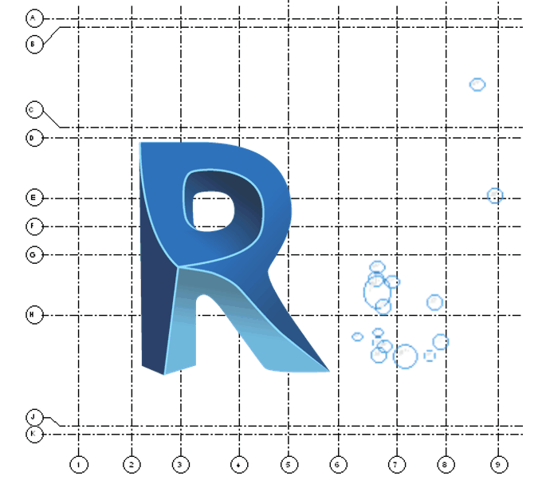
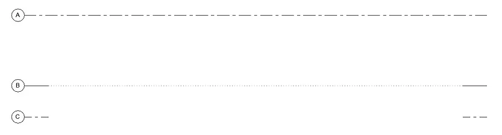
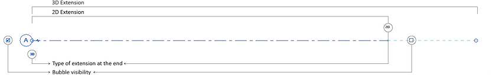

<!-- {
"createdAt": "Aug 7, 1993",
"title": "Structural Grid Bubbles",
"tags": ["Dynamo", "Revit API", "Python"],
"votes": 0,
"views": 384,
"published": true
} -->

# Structural Grid Bubbles

> :::image-small
>
> 

Hi guys,

most of the drawings coming out from Revit show **Grids** and that's the proof of how they are important for us architects/engineers/construction enthusiasts...

In this post, I want to summarize some ways of representing Grids in Revit so as to achieve the exact result each drawing deserves.

---

Let's not focus on the creation of a Grid, which is something I guess you already know how to do, but on the **duality of their representation** on the 2D views. <br />
In fact, when you draw a Grid, it's represented as per its 3D extension in each of the <span style="color:red">2D drawings\*</span   >, the only _fun_ we might have at that point is connected with the **Grid type** we decide to create which gives us the possibility of defining a specific aspect for the bubble as well a possible interruption in the grid so the only the extremities are shown as per default.

<span style="color:red">\*</span>as long as the Grid stays in the crop box, if not, it automatically switches to 2D.

> :::image-large
>
> 

Once the general rules for your Grids have been defined, it starts the more detailed work that allows the correct representation on all the 2D drawings. What Revit permits you to do is to create a 2D representation of a Grid so as to show it with a custom extension per each view and, potentially, use the same settings about the extension on a multitude of drawings, as long as they're parallel.

What people forget often to mention, is that also the **_Visibility of the grid bubbles_** should be easy to align as we can do for the 2D line extension, though, at the moment I'm writing this post, this operation is **not yet possible with OOTB Revit tools**, but we did it!!

> :::image-large
>
> 

Above is the image of a grid with all the 2D representation possibilities highlighted, our solution is looking to **_align all the check-boxes_** defining the **Bubble visibility**.

---

## How to match bubble grids in different views

Above this one million dollar question, that we answer easily as usual with a Dynamo node!<br />
Is just one node, and doesn't need very many explanations - <i style="color:orange">this is why we like it!</i>

Differently from the classic Revit operation, this one can also be performed for **views NOT parallel between each other**!<br />
And to explain the reason, we should dive a **_bit deeper_**... first of all, let's stop calling the Grids "Grids", this is just the user version, I'm about to introduce to you the [DatumPlane](https://apidocs.co/apps/revit/2022.1/3e0a6725-ee40-c4d5-839f-b7720c1fe2af.htm).

---

Yes, here we are with the **_Curiosity_** section!<br />
DatumPlane is the class to which the Grids are referring, and, precisely for our purposes, has a couple of methods that let the script possible!

- DatumPlane.IsBubbleVisibleInView(DatumEnds, View)
- DatumPlane.ShowBubbleInView(DatumEnds, View)

DatumEnds is actually an Enumeration that helps us specify the **start or the end of the gridline**, the methods are to be applied to the grid (DatumPlane) which, as we can assume, controls the way it is shown in the 2D drawings... and that's the shocking part:

    The way a Grid is represented on a view depends on the Grid itself, not the view.

For those of you who like to read codes, here is a #Python function that, using the #RevitAPI, matches the bubbles of a given "grid" as they are shown on a view "vw", with another view "vw2".

```python
def match_bubbles(vw, grid, vw2):
	if grid.IsBubbleVisibleInView(DatumEnds.End0, vw):
		grid.ShowBubbleInView(DatumEnds.End0, vw2)
	else:
		grid.HideBubbleInView(DatumEnds.End0, vw2)
	if grid.IsBubbleVisibleInView(DatumEnds.End1, vw):
		grid.ShowBubbleInView(DatumEnds.End1, vw2)
	else:
		grid.HideBubbleInView(DatumEnds.End1, vw2)
```

---

And here the excursus on the Grids ends... it's funny to think that they are always on our screens and we might even not know what their real name is, "Datum Plane"!! Well, now we know and we also know how strong they are, enough to don't even permit at views to decide how they could look on them!!

If I only were a Revit View I'd probably say: "Yes, you know, Grids are like that, this guest you like to have, sometimes you really need to... but they do whatever they want, you can just give them space... _Like cats in human homes!_ "

> :::image-small
>
> 

I couldn't leave you but with a smile!!<br />
Cheers!
