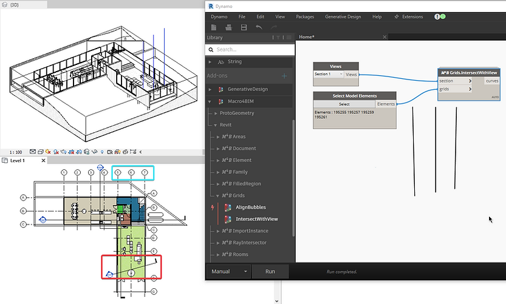
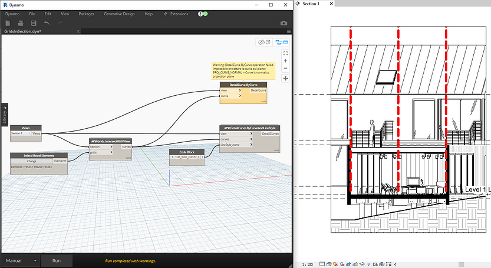
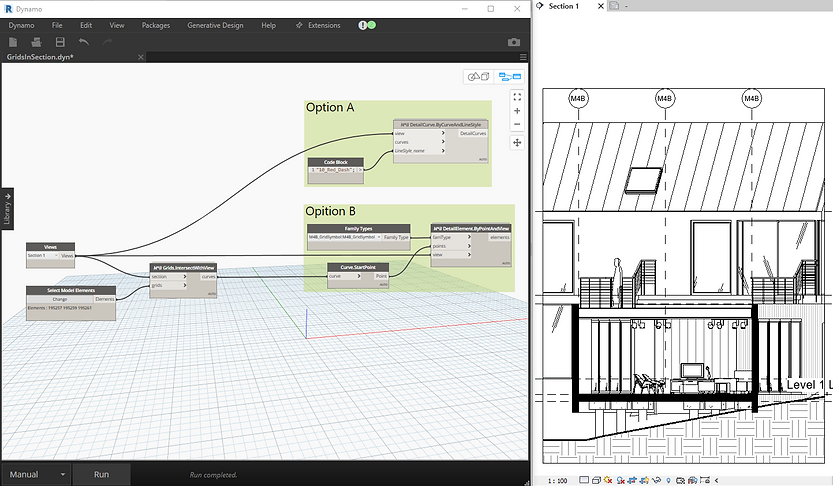
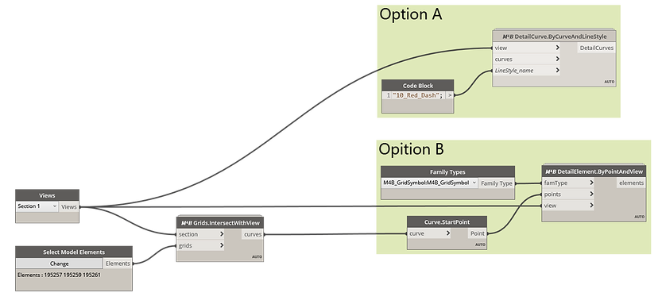

<!-- {
"createdAt": "Aug 7, 1993",
"title": "Template",
"tags": ["Dynamo", "Revit API", "Python"],
"votes": 0,
"views": 1268,
"published": false
} -->

# Show non-perpendicular Structural Grids

Hi all,

With Revit 2022 the Grids are finally visible in 3D views, **_great achievement_**!! Though, they still <span style="color:red">aren't displayed in sections</span> and/or elevations whose view plane is not perpendicular to the grid.

After this [post](https://www.macro4bim.com/post/structural-grid-bubbles) on the grids, I had a couple of chats with [Andrea](https://www.linkedin.com/in/andrea-guiatti-a12b13147/), an old friend now Architect at Populous. He was happy about the attention Macro4BIM gave to the **Grids representation** and came up with another interesting topic on the matter:

    What about letting the structural grids be visible in sections and elevations not perpendicular to the grid themself?

This is actually a topic that most of us encountered working with Revit and, most of the time we simply accept it like it is, without showing some grids on some sections or elevation, from the representation point of view is ok, and avoid several potential "weird dimensions".<br />
But Andrea (Guio for friends) had a **_very fair point_** on his side: **How many stadiums are you designing?**

This sounds really like a "<span style="color:blue">we must find a solution!</span>" and here we are, with a new post.

---

## How to show grids in a non-perpendicular section

We solved the task using more than one Dynamo custom node, this way you'll be free to **adapt the result** to what fits better to your needs. Here we will **_show you 2 solutions_** of 2 steps each, but if you have any other, we'd be very curious to hear about them!!

### 1. Get intersection Grid-SectionView

In the image below you can see how 3 vertical lines have been created once given to the node the section view (red rectangle) and grids (cyan rectangle).<br />
We used the custom node Revit.𝑀⁴𝐵 Grids.IntersectWithView,

> :::image-large
>
> 

Once you have this, it's all up to you on how to move on, here are a couple of suggestions:

### 2a) create Detail Lines on grids position

In principle I thought would have been something doable with the OOTB Dynamo node... <b style="color:red">but not</b>!

So we decided to develop one more custom node, **Revit.𝑀⁴𝐵 DetailCurve.ByCurveAndLineStyle**, for creating Detail Lines (Detail Curves in Dynamo) that, _in addition to the OOTB_, more that actually create the Detail Lines, gives you the possibility to **define the LineStyle** you want to use, simply by giving its name.

> :::image-large
>
> 

### 2b) Place Annotation Symbol

In case you want a more detailed representation of your Grid, you definitely need to create a family Symbol, which keeps its size independently from the drawing scale. Once created, would be of course nice to automatize its placement with Dynamo. Everything we need is a node to place 2D families on views and... here we go!! **Revit.𝑀⁴𝐵 DetailElement.ByPointAndView**

> :::image-large
>
> 

From the snip is also visible the dummy Symbol we made for the presentation, which has "M4B" written in the grid bubble.

Just for sake of completion, here is the screen of the graph with a better resolution.

> :::image-large
>
> 

---

This was all, a couple of workflows you can easily implement into a **_DynamoPlayer_** script so to keep your grids always readable!

But **be mindful**: <span style="color:red">THE ANNOTATIONS ARE NOT CONNECTED TO THE GRIDS</span>. If the grids change, will be important to update their position by running again the script!

---

The post could have already been finished, but I don't feel like wrapping it without our classic **Curiosity** section, so let me show you the behind-the-scenes of the script that permits the creation of the "Intersection" between Grids and View.

> :::image-small
>
> 

Proceeding per steps, we **1)** extract the curves from the grids, which sit by default at elevation 0.00; **2)** use some properties\* of the section view to create a line in the same position of the section view, but at elevation 0.00; **3)** get the intersection point\*\* between the lines and 4) create a vertical line extended as the grid height.

\*The properties are [.Origin](https://apidocs.co/apps/revit/2022.1/dbc12b94-75fb-4f5b-ddaf-00f76c6f9290.htm) and [.RightDirection](https://apidocs.co/apps/revit/2022.1/31c1d1ff-845b-0037-bf69-0735244f51b0.htm), but please, go read the remark for the Origin property, where it says "The origin of a plan view is not meaningful."... Why is that? come on, _nothing is really meaningful_ and with the use of this property as we showed in this post, I hope we demonstrated.

\*\* For this purpose, we used a method -[ComputeClosestPoints](https://apidocs.co/apps/revit/2022.1/04ab73d1-bc85-9b87-aace-4272a0c7c3e4.htm)- very much interesting because, differently from the majority of the methods used in the Revit API, **it returns nothing but an edit input**. Also, this input is a type of collector -StrongBox- very rarely used which I think is worth sharing with a snip of code.

```python
if ln.Intersect(crv) == SetComparisonResult.Overlap:

	pts = clr.StrongBox[IList[ClosestPointsPairBetweenTwoCurves]]([])
	ln.ComputeClosestPoints(crv, False, False, False, pts)

	for i in pts.GetEnumerator():
		return i.XYZPointOnFirstCurve
```

---

With this was really all, let us know if there are any comments and, as always, we hope you found this post interesting and maybe also useful for some of your current or future projects!

Cheers
