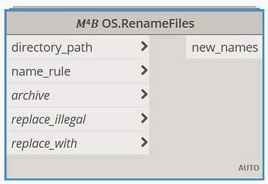

<!-- {
"createdAt": "Sep 18, 2022",
"title": "Renaming model exports",
"tags": ["M4B package", "pyRevit/ryM4B", "Bim-Coordinator"],
"votes": 0,
"views": 123,
"published": true
} -->

# Renaming model exports

Hello beautiful people,

Today I was looking delighted at the new function for exporting PDFs straight from Revit, and I was happy to see how my colleagues and friends are positively surprised by the function that also permits renaming the files using some Revit parameters.

Happy and surprised, because this is a type of work I have seen people doing for long and for which we prepared a script that is the time to share with you all!

Our intention is to permit the rename of the output files based on Revit parameters, to all the file extensions (not only PDF. also DWG, DXF, JPG, ... ).

## How to

To keep it easy, we developed a Dynamo Custom Node which takes as input the folder containing the files to rename and a particular string that will teach the node how to rename the files.

> :::image-small
>
> 

The particular string is not after all that "particular" since it just consists of putting between parentheses the name of the parameters you want to use for renaming the file.

The only thing to remember is that square brackets [] are for Sheets' parameters, and curly brackets {} are for Project Info parameters.

    TheNameYouWant*{ProjectInfoParameter}*[SheetParameter]

> :::image-small
>
> 
>
> Alert, alert, **no Ctrl+Z** for this function!

In addition, the function can **automatically create an archive** of the files before the script runs. This should cold you down from the aforementioned alert.

---

And this was all. I hope you enjoyed the post and you'll make good use of this solution! 
Feel free to reach out to us anytime,

Cheers!
