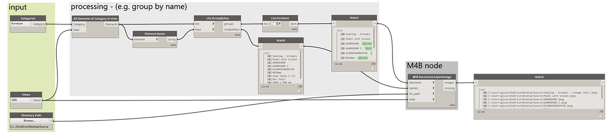

<!-- {
"createdAt": "Mar 20, 2023",
"title": "Generate 1 image per Element 📸",
"tags": ["Dynamo", "Revit API", "Python"],
"votes": 3,
"views": 310,
"published": true
} -->

# Generate 1 image per Element 📸

Hey, you, Revit Elements in the project...

> :::image-small
>
> 

Have you ever wanted to be the photographer of the families and types in your project? Well, maybe not quite the dream job, but surely having some photo shoots of the elements you are working with can be useful!!

---

### Why to

At first glance, here are a couple of reasons why you would like to do so:

1. Creating a **_pictionary_** of the families in your office Revit library. This would help all the users to quickly recognize if the component they are looking for is or is not in the library.
2. Integrate your schedules with some dedicated images that could help the person that reads the data to better correlate with the modeled elements. For example, what about having a set of images named exactly as the type mark  of some specific families??

While the first example/reason is serving an office-based need, the second is clearly project-based and definitely **versatile**... We hope it is clear to everyone why we develop such a function!!

---

### How to

The tool that we recently added to the M4B Dynamo package is called **"M4B Document.ExportImage"** and it is actually exporting one image per given element, Shooting from the point of view of the selected 3D View.

We'll skip the part when we say "it is very easy!!"... So directly have a look at this graph:

> :::image-large
>
> 

Apart from the crazy amount of time that this tool saves, what we also love is the consistency between all the generated images, named accordingly to our intentions!

Too good to be true? Well, this is what happened on our PC right after running the above script, and the GIF is in real-time!

---

As always, we hope you enjoyed the post and you found it most useful! Any feedback is of course very welcome.

Cheers!
