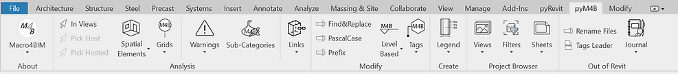

<!-- {
"createdAt": "Oct 28, 2023",
"title": "pyM4B issue fixed",
"tags": ["pyRevit", "pyM4B", "Python"],
"votes": 0,
"views": 121,
"published": true
} -->

# pyM4B issue fixed

As some of you already know, during the past week we had an issue with pyM4B for which some panels were not displaying correctly.

I'm happy to announce that the problem is now fixed and here is how the most updated pyM4B looks like:

> :::image-large
>
> 

The root cause of the issue was something I didn't expect: the folder names on GitHub, at the moment of the commit, are not case-sensitive.

In practical terms, we changed the panel's name from "Coordination.panel" to "COORDINATION.panel" in both the folder name and in the boudle.yaml. On GitHub, an so your computers, only the boundle.yaml got changed, messing up the correct functioning of the extension.

---

In case you also publish regurarily on GitHub and are not aware of the issue, we'd like to spend a couple of lines more to show how we sorted this out.

## How to rename folders on GitHub?

The solution to commit a folder with a different case is to pass through an intermediate commit where the folder name is different not only case-wise.

For instance, if you want to change a folder named "about.panel" into "About.panel", you should first commit something like "About.panel-----", and then you'll be able to commit back with the desired name "About.panel".

Considering the amount of folders in a pyRevit extension, I wrote a quick Python script that renames all the folders. It may not be the most elegant solution, but it worked like a charm and it was pretty fast. I'm sharing down here the script:

```python
import os

def rename_nested(folder, suffix, add=True):
    """
    Order to follow to solve the case-sensitive issue:
        1. run the function with add=True
        2. commit the changes
        3. run the function with add=False
        4. commit for the last time
    Args:
        folder (str): the main folder to rename, with the nested as well
        suffix (str): the unique string to add/remove from the path
    """
    amount = 0
    for dirpath, dirnames, filenames in os.walk(folder):
        for d in dirnames:
            complete_dir = os.path.join(dirpath, d)
            if add:
                new_path = complete_dir+suffix
            else:
                new_path = complete_dir.replace(suffix,'')
            os.rename(complete_dir, new_path)
            amount += 1
            amount += rename_nested(new_path, suffix, add)
        break
    return  amount

folder = os.path.dirname(__file__)
suffix = '-----'

# rename_nested(folder, suffix, enum)
amount = rename_nested(folder, suffix, add=False)
print(f'{amount} folders renamed successfully.')
```

I hope this helps anyone who is facing the same issue.

Cheers!
