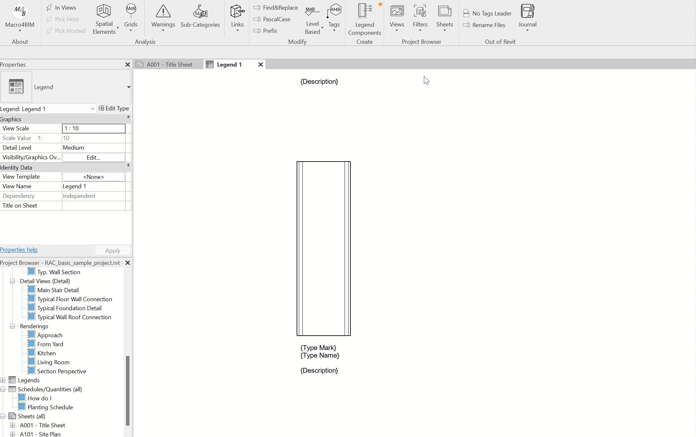

<!-- {
"createdAt": "Nov 7, 2023",
"Title": "Automatic Legend Components",
"tags": ["Materia tags", "Revit Family", "Dimensions"],
"votes": 4,
"views": 622,
"published": true
} -->

# Automatic Legend Components

Hi everyone,

I'm excited to share with you a new feature of the pyM4B extension for Revit. This feature allows you to automatically create Revit legends for your drawings in a fast and easy way. Let me show you how it works.

The feature is called "Legend Component", and, starting from a selected legend component, it creates one component per Family Type\* of the selected category.

- It collects only used Family Types.

But that's not all, because the main issue with the legend components in Revit is that, once placed, they can be tagged by material tags, but not dimensioned! 😡

### How to dimension legend components?

Our tool, if a legend component of a compound object is selected, also places all the **material tags and automatic dimensions** ✨. This is something that Revit doesn't do by default, so it saves you a lot of time and hassle.

Good points

- 🤓 Material tags equally spaced
- 🤖 Dimensions are possible thanks to the presence of very small (and dimensionable) annotation lines placed automatically by the computer.

## How to

To use the feature, you need to have the [pyM4B](https://www.macro4bim.com/pym4b) extension installed in your Revit. Then, you need to (1) select a source legend component, (2) a TextNote with the name of the parameters you want to have in your legend written between { }, only and in case your legend component is a compound object (walls, floors ...), select the Material Tag Type to use.

The whole process is so quick that could have been recorded in a GIF!

> :::image-large
>
> 

### Alert!!

You might have noticed that some material tags somehow don't recognize their host, we couldn't give an explanation for it, but selecting them all and moving back and forward ⇄, permits the restoration of the host.

And that's it! You have created your legends in minutes, without having to manually draw or tag anything.

---

I hope you find this feature useful and helpful for your projects. If you have any feedback or suggestions, please let me know in the comments below.

Cheers!
